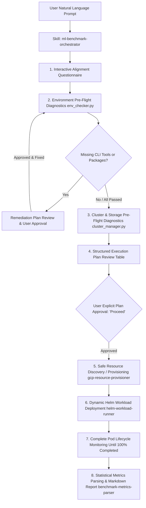

# gcloud-ml-benchmarks: AI Agent-Driven ML Storage Benchmark & PoC Suite

A unified, AI Agent-driven benchmarking and PoC harness for evaluating high-throughput Machine Learning I/O performance on Google Cloud Platform (GCP) and Google Kubernetes Engine (GKE).

This suite empowers ML engineers, storage architects, and AI Agent assistants to trigger real-world ML training demos, PoCs, and I/O performance benchmarks across **Google Cloud Storage (GCSFuse & `gcsfs`)** and **Google Cloud Managed Lustre**.

---

## Supported Storage Systems & Workloads

### Primary Storage Systems
1. **Google Cloud Storage (GCS)**: Evaluated via **GCSFuse Streaming Writes** (`GcsFuseCsiDriver`), **Direct GCS Client** (`pyarrow.fs.GCSFileSystem`, `google-cloud-storage`), and native Python **`gcsfs` REST API**.
2. **Google Cloud Managed Lustre**: High-performance parallel file system evaluated via `LustreCsiDriver`.

### Workload Harnesses
- **Orbax Checkpoint Benchmark (`workloads/orbax-checkpoint-benchmark`)**: Distributed ML macrobenchmark evaluating Orbax/TensorStore checkpoint topology resharding (e.g. 5 shards $\to$ 10 workers or 100 $\to$ 500 TPU chips), offline CPU bounded streaming rewrite, optimizer state stripping, and concurrent restore acceleration over GCSFuse / Zonal RAPID GCS.
- **MaxText Dataset Loader (`workloads/maxtext-dataset-loader`)**: MaxText JAX LLM training input pipeline benchmark evaluating Parquet Range Reads, ArrayRecord streaming, and native In-Tree DataLoader over Native GCS Client (`gs://...`) and GCSFuse Sidecar (`/gcs/...`).
- **Multi-Format Dataset Loading (`workloads/multi-format-dataset-loader`)**: Standalone and multi-node dataset streaming benchmark evaluating Parquet, WebDataset TAR, Zarr/TensorStore, PyTorch `.pt`, and JSONL ingestion throughput, TTFB, and latency percentiles.
- **TensorStore / Zarr (`workloads/tensorstore-gcsfuse`)**: Multi-node array read/write benchmark evaluating chunking, concurrency, network MTU tuning, and gRPC streaming.
- **PyTorch DDP (`workloads/hf-pytorch-lightning-cpu`)**: Simulates Llama 3.1 8B multi-node distributed training, dataset streaming, and 45 GB model state dict checkpointing across **Managed Lustre**, **GCSFuse**, and **`gcsfs`**.

---

## Modular AI Agent Skills

This repository is built natively for AI Agent-driven operations and provides modular, specialized skills:

- **`ml-benchmark-orchestrator`**: Master orchestrator. Interactively aligns with the user, validates prerequisites and environment diagnostics, presents structured execution plan tables, and coordinates end-to-end benchmark execution.
- **`orbax-checkpoint-benchmark`**: Specialized benchmark skill for Orbax and TensorStore checkpoint offline resharding, topology adaptation, optimizer stripping, and concurrent restore acceleration.
- **`maxtext-dataset-benchmark`**: Specialized benchmark skill for MaxText dataset loading (Parquet vs. ArrayRecord, direct GCS vs. GCSFuse, shuffle strategies).
- **`gcp-resource-provisioner`**: Discovers or provisions GKE clusters, Managed Lustre PVCs, GCS buckets, and Workload Identity IAM bindings safely with zero resource mutation.
- **`helm-workload-runner`**: Dynamically constructs Helm commands, deploys benchmark releases, tracks Pod execution lifecycle asynchronously until completion, and handles graceful teardown.
- **`benchmark-metrics-parser`**: Parses container stdout logs via `parse_metrics.py` to extract MB/s throughput, TTFB, and latency percentiles into Markdown comparative reports.

---

## Repository Structure

```
gcloud-ml-benchmarks/
├── skills/                      # Modular AI Agent Skills for benchmark automation
│   ├── ml-benchmark-orchestrator/ # Master orchestrator & interactive user alignment
│   ├── orbax-checkpoint-benchmark/# Orbax & TensorStore resharding and restore skill
│   ├── maxtext-dataset-benchmark/ # MaxText Parquet & ArrayRecord benchmark skill
│   ├── gcp-resource-provisioner/ # GKE, Lustre PVC, GCS bucket & IAM discovery/setup
│   ├── helm-workload-runner/   # Dynamic Helm execution, async tracking & teardown
│   └── benchmark-metrics-parser/# Empirical log parsing & Markdown report generator
├── tools/                       # Formal CLI utilities & pre-flight diagnostics
│   ├── infrastructure/          # Cluster manager, bucket manager, env checker
│   ├── datasets/                # Synthetic dataset generator & converters
│   └── checkpoints/             # Orbax offline reshard rewriter & restore benchmark
├── workloads/                   # Benchmark workload definitions & Helm charts
│   ├── orbax-checkpoint-benchmark/ # Orbax checkpoint offline resharding & restore harness
│   │   └── README.md
│   ├── maxtext-dataset-loader/  # MaxText Dataset loading benchmark & demo (Parquet, ArrayRecord)
│   │   └── README.md
│   ├── multi-format-dataset-loader/ # Multi-format dataset streaming benchmark harness
│   │   └── README.md
│   ├── tensorstore-gcsfuse/     # TensorStore multi-node array I/O harness
│   │   └── README.md
│   └── hf-pytorch-lightning-cpu/ # PyTorch Llama 3.1 8B DDP training & checkpoint harness
│       └── README.md
└── docs/                        # Documentation suite organized by benchmark workload
    ├── README.md                # Master documentation index
    ├── orbax/                   # Orbax & TensorStore Checkpoint Suite
    │   ├── README.md            # Workload overview & architecture
    │   ├── step_by_step_guide.md# Reproduction guide
    │   └── results/             # Results (100GB restore, shard layout, rewriter)
    ├── maxtext/                 # MaxText Parquet & ArrayRecord benchmark suite
    │   ├── README.md            # Workload overview & architecture
    │   ├── parquet_range_reads_guide.md # Reproduction guide (Native GCS & GCSFuse)
    │   └── results/             # Results (Parquet vs ArrayRecord, shuffle modes, access modes)
    ├── multi_format_dataset/    # Multi-format dataset loading benchmark suite
    │   ├── README.md            # Workload overview & format matrix
    │   ├── step_by_step_guide.md# Reproduction guide
    │   └── results/             # Results (Format comparison: Parquet, TAR, Zarr, PT)
    ├── tensorstore/             # TensorStore + GCSFuse benchmark suite
    │   ├── README.md            # Workload overview & architecture
    │   ├── step_by_step_guide.md# Reproduction guide
    │   └── results/             # Results (Scaling, MTU, protocols, chunks, concurrency)
    └── pytorch/                 # PyTorch + Storage benchmark suite
        ├── README.md            # Workload overview & architecture
        ├── step_by_step_guide.md# Reproduction guide (Lustre, GCSFuse, gcsfs)
        └── results/             # Results (Checkpointing, rank scaling)
```

---

## Documentation & Results Index

- **Orbax & TensorStore Checkpoint Benchmarks**:
  - [Orbax Documentation Overview](docs/orbax/README.md)
  - [Step-by-Step Reproduction Guide](docs/orbax/step_by_step_guide.md)
  - [100GB Checkpoint Resharding & Restore Benchmark Report](docs/orbax/results/100gb_restore_acceleration.md)

- **MaxText Dataset Ingestion Benchmarks**:
  - [MaxText Documentation Overview](docs/maxtext/README.md)
  - [Parquet Range Reads & ArrayRecord Guide](docs/maxtext/parquet_range_reads_guide.md)
  - [ArrayRecord Range Read Chunk Size Scaling on GCSFuse CSI Driver](docs/multi_format_dataset/results/arrayrecord_range_read_chunk_size_scaling.md)
  - [Parquet vs. ArrayRecord Results](docs/maxtext/results/parquet_vs_arrayrecord.md)
  - [Shuffle Strategies: None vs. Two-Stage vs. Global](docs/maxtext/results/shuffle_strategies.md)
  - [Storage Access Modes: GCSFuse CSI vs. Native GCS](docs/maxtext/results/storage_access_modes.md)

- **Multi-Format Dataset Loading Benchmarks**:
  - [Multi-Format Dataset Documentation Overview](docs/multi_format_dataset/README.md)
  - [Step-by-Step Reproduction Guide](docs/multi_format_dataset/step_by_step_guide.md)
  - [ArrayRecord Range Read Chunk Size Scaling](docs/multi_format_dataset/results/arrayrecord_range_read_chunk_size_scaling.md)
  - [Hugging Face Parquet Manifest.json vs. Dynamic Globbing](docs/multi_format_dataset/results/hf_parquet_manifest_comparison.md)
  - [GCSFuse CSI Mount vs. Direct GCS (`gcsfs`) Parquet](docs/multi_format_dataset/results/gcsfuse_vs_direct_gcs_parquet.md)
  - [Format & Backend Performance Comparison](docs/multi_format_dataset/results/format_comparison.md)

- **TensorStore + GCSFuse Benchmarks**:
  - [TensorStore Documentation Overview](docs/tensorstore/README.md)
  - [Step-by-Step Reproduction Guide](docs/tensorstore/step_by_step_guide.md)
  - [Multi-Node Cluster Scaling (1 to 32 Nodes)](docs/tensorstore/results/node_scaling.md)
  - [Network MTU Tuning (8896 Jumbo Frames vs 1500 MTU)](docs/tensorstore/results/network_mtu.md)
  - [Client Protocols (HTTP/1.1 vs gRPC)](docs/tensorstore/results/client_protocols.md)
  - [Zarr Chunk Size & Slicing Latency](docs/tensorstore/results/chunk_size_and_file_size.md)
  - [GCSFuse Memory Block Buffer Tuning](docs/tensorstore/results/global_max_blocks.md)
  - [Worker Process Concurrency](docs/tensorstore/results/process_concurrency.md)
  - [Thread Concurrency & I/O Parallelism](docs/tensorstore/results/thread_concurrency.md)

- **PyTorch DDP Benchmarks**:
  - [PyTorch Documentation Overview](docs/pytorch/README.md)
  - [Step-by-Step Reproduction Guide](docs/pytorch/step_by_step_guide.md)
  - [Model Checkpoint Write Performance & Streaming](docs/pytorch/results/checkpoint_write_performance.md)
  - [Model Checkpoint Restore Performance & Caching](docs/pytorch/results/checkpoint_restore_performance.md)
  - [Rank Topology & RAM OOM Prevention](docs/pytorch/results/rank_scaling_and_memory.md)

---

## Running Benchmarks & Demos with AI Agent

This repository is designed for interactive execution via AI Agents equipped with our modular skills.

### Natural Language Prompt Examples

Prompt your AI Agent in natural language to run benchmarks:

- **Orbax Checkpoint Offline Resharding & Restore Speedup**:
  > "Run the Orbax checkpoint benchmark on GKE comparing 5-shard un-rewritten restore vs 10-worker rewritten restore on a 100GB checkpoint with GCSFuse."

- **MaxText Dataset Ingestion Benchmark**:
  > "Help me run the MaxText dataset benchmark comparing Parquet range reads and ArrayRecord streaming on GCS with two-stage shuffle."

- **PyTorch Storage Evaluation (Lustre vs. GCSFuse vs. Direct GCS)**:
  > "Run a comparative benchmark evaluating PyTorch DDP Llama 3.1 8B checkpointing speed across Managed Lustre and GCSFuse streaming writes on 2 nodes."

- **Multi-Format Ingestion Throughput**:
  > "Benchmark dataset ingestion throughput across Parquet, WebDataset TAR, and Zarr formats on a 4-node GKE cluster."

- **TensorStore Cluster Scaling & MTU Tuning**:
  > "Evaluate TensorStore array I/O performance on GCSFuse comparing 8896 Jumbo Frames vs standard 1500 MTU."

---

### End-to-End Skill Execution Lifecycle



1. **Interactive Alignment Questionnaire**: The Agent conducts an alignment interview to clarify target workload, dataset path, storage access mode (`gcsfuse`, `native_gcs`, `lustre`), shuffle strategy (`none`, `two_stage`, `global`), and worker concurrency (`num_workers`, `prefetch_factor`).
2. **Environment & Dependency Pre-Flight Diagnostics (`tools/infrastructure/env_checker.py`)**: The Agent validates the local and cloud execution environment before touching any resources:
   - System CLI tools: `gcloud`, `kubectl`, `helm`, `python3`, `git`.
   - Python package dependencies: `google-cloud-storage`, `pyyaml`, `pyarrow`, `pandas`, `requests`.
   - GCP Project, active authentication context, and Kubernetes cluster reachability.
   - **Remediation Plan Protocol**: If any dependency is missing, the Agent generates a structured Remediation Plan table and requests user confirmation before running fixes (no autonomous unapproved commands).
3. **Cluster & Storage Pre-Flight Inspection (`tools/infrastructure/cluster_manager.py`)**: Automatically inspects GKE Kubernetes version, node hardware specs (`n4-standard-80`, `c4-standard-192`), GCSFuse CSI Driver version tag (`v1.22.21-gke.1`), VPC network MTU (`8896 Jumbo Frames` vs `1500 Standard`), and JobSet CRD.
4. **Structured Execution Plan Review**: The Agent presents a comprehensive pre-flight Markdown table detailing workload specs, storage flags, dataset dimensions, and cloud resource cost estimates. The Agent strictly pauses and waits for explicit user confirmation (`Proceed` / `确认`) before proceeding.
5. **Safe Resource Discovery & Provisioning (`gcp-resource-provisioner`)**: Enforces persistent asset protection (never deletes existing buckets or datasets). Discovers Managed Lustre mounts or provisions GCS buckets deterministically via committed tools (`bucket_manager.py`).
6. **Dynamic Helm Workload Deployment (`helm-workload-runner`)**: Constructs Helm chart flags dynamically and launches benchmark releases (MaxText, PyTorch DDP, Multi-Format Loader, TensorStore).
7. **Complete Pod Lifecycle Monitoring**: Monitors Pod states asynchronously until 100% of workload pods reach `Completed` status (preventing premature release uninstalls).
8. **Statistical Metrics Parsing & Markdown Reporting (`benchmark-metrics-parser`)**: Parses container stdout logs via `parse_metrics.py` to extract TTFB, MB/s throughput, latency percentiles (p50/p95/p99), and duration averages into a publication-ready comparative Markdown summary.
