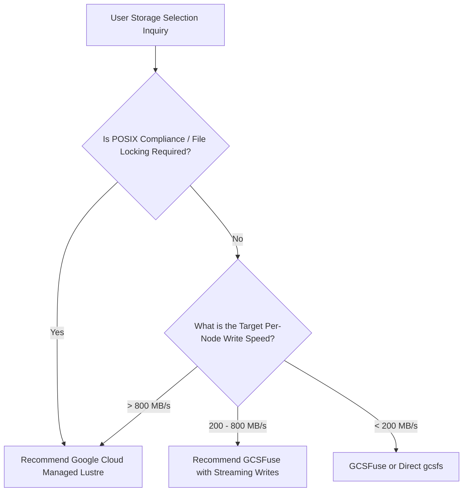

# GCP ML Storage Architecture Knowledge Base & Best Practices

This document serves as the authoritative, persistent knowledge base for AI Agents and GCP ML engineers when evaluating storage performance for Machine Learning workloads on Google Cloud Platform (GCP) and Google Kubernetes Engine (GKE).

---

## 📊 1. Empirical Benchmark Performance Baselines

The following performance numbers were measured on GKE (`chongliu-gke-persistent`, Zone `us-central1-b`, `n4-standard-80` nodes) using the PyTorch DDP Llama 3.1 8B workload harness (`hf-pytorch-lightning-cpu` simulating a 45 GB model checkpoint):

| Storage Solution | Client Access Mechanism | Measured Raw Write Speed | Dataset Load Latency | Total Checkpoint Save Duration | Aggregated Throughput |
| :--- | :--- | :--- | :--- | :--- | :--- |
| **Google Cloud Managed Lustre** | `LustreCsiDriver` (Static PVC) | **953.41 MB/s (9.53 Gbps)** | **0.08 seconds** | **53.16 seconds** | **863.70 MB/s** |
| **GCSFuse (Streaming Writes)** | `GcsFuseCsiDriver` (Ephemeral Mount) | **611.51 MB/s (6.12 Gbps)** | **0.28 seconds** | **76.80 seconds** | **503.29 MB/s** |
| **Direct GCS REST API (`gcsfs`)** | Python `fsspec` / `gcsfs` | **192.64 MB/s (1.93 Gbps)** | **0.80 seconds** | **238.53 seconds** | **192.64 MB/s** |

---

## 💾 2. Storage System Characteristics & Architectural Best Practices

### ⚡ Google Cloud Managed Lustre (`LustreCsiDriver`)
- **Type**: Fully managed POSIX parallel file system.
- **Performance Scaling**: Throughput scales linearly with provisioned capacity (~1,000 MB/s per TiB provisioned). Sub-millisecond metadata operations.
- **GKE Network Tuning**:
  - **VPC MTU 8896 (Jumbo Frames)**: Configure VPC network MTU to **8896 bytes** (up from default 1460), delivering up to **10% throughput improvement**.
  - **Tier_1 High-Bandwidth Networking**: Utilize `TIER_1` networking on compute-optimized node pools (e.g. C3, C4, N4) to maximize node network egress (typically ~2 Gbps per vCPU).
- **Capacity Management**: Keep storage utilization below 90% to avoid IOPS throttling and performance degradation.
- **Best Suited For**: Large-scale distributed training (>32 nodes), multi-node POSIX file locking, heavy random I/O, and fast checkpoint recovery.

### 🌊 GCSFuse Streaming Writes (`GcsFuseCsiDriver`)
- **Type**: FUSE file system interface backed by Google Cloud Storage object storage.
- **Performance Tuning Flags**:
  - **Streaming Writes Engine (`enable-streaming-writes=true`)**: Direct-to-GCS streaming upload bypassing local disk staging. Reduces latency and local disk wear for sequential write-to-new single files (training checkpoints).
  - **Negative Stat Cache Optimization (`metadata-cache:negative-ttl-secs=0`)**: Essential for training/checkpointing workloads where files/directories are frequently created or checked.
  - **Global Max Blocks (`write:global-max-blocks=-1`)**: Prevents hitting block limits during multi-threaded heavy writes, avoiding fallback to staged writes.
- **Best Suited For**: Sequential dataset streaming, cost-effective checkpointing, and applications requiring standard file system interfaces without dedicated file server infrastructure.

### 🐍 Direct GCS Python REST API (`gcsfs`)
- **Type**: Native Python `fsspec` HTTP client accessing GCS directly over REST.
- **Performance Profile**: Single-stream throughput bounded by Python GIL and HTTP chunking (~150-200 MB/s per process).
- **Best Suited For**: Lightweight data loading scripts, debugging, or single-node jobs without FUSE CSI driver installation.

---

## 🧮 3. ML Workload Mathematical Estimations

### Checkpoint Size Estimation Formulas
- **Model State Dict (BF16 / FP16 Precision)**:
  $$\text{Checkpoint Size (GB)} \approx 2 \times \text{Parameters (in Billions)}$$
  *(Example: Llama 3.1 8B state dict $\approx 16 \text{ GB}$)*

- **Full Training State Dict (AdamW Optimizer)**:
  $$\text{Training Checkpoint Size (GB)} \approx (2 + 4 + 4) \times \text{Parameters (in Billions)} = 10 \times \text{Parameters (in Billions)}$$
  *(Example: Llama 3.1 8B with AdamW master weights & momentum $\approx 80 \text{ GB}$)*

### Training Stall Overhead Estimation Formula
$$\text{Training Stall Time (seconds)} = \frac{\text{Checkpoint Size (GB)} \times 1024}{\text{Write Throughput (MB/s)}}$$

#### Comparison Example for 64 GB Checkpoint:
- **`gcsfs` (192 MB/s)**: $\frac{64 \times 1024}{192} \approx 341 \text{ seconds}$ (~5.7 minutes stall per checkpoint).
- **GCSFuse (611 MB/s)**: $\frac{64 \times 1024}{611} \approx 107 \text{ seconds}$ (~1.7 minutes stall per checkpoint).
- **Managed Lustre (950 MB/s)**: $\frac{64 \times 1024}{950} \approx 69 \text{ seconds}$ (~1.1 minutes stall per checkpoint).

---

## 🌳 4. Recommended Architectural Decision Tree

