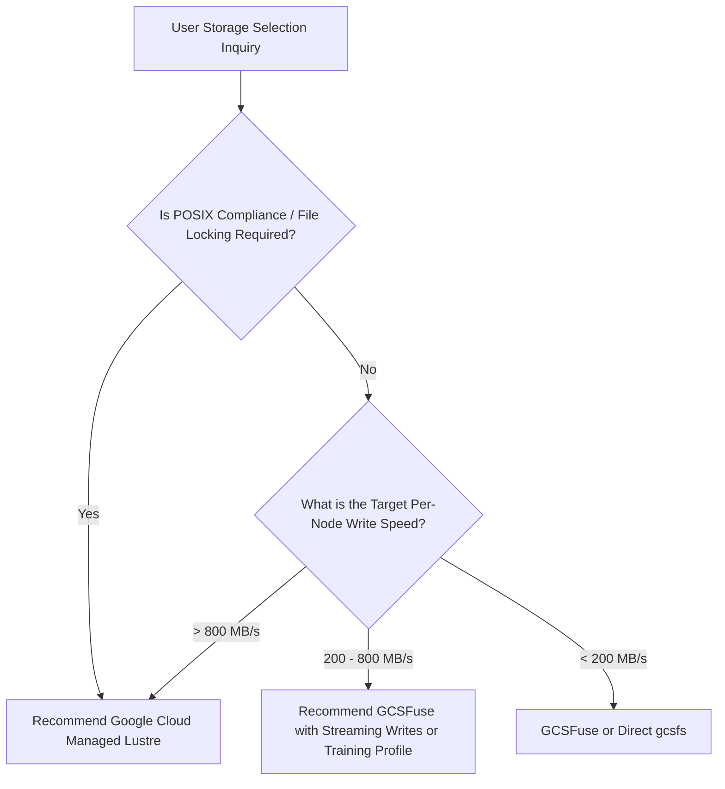

# GCP ML Storage Architecture Knowledge Base & Best Practices

This document serves as the authoritative, persistent knowledge base for AI Agents and GCP ML engineers when evaluating storage performance for Machine Learning workloads on Google Cloud Platform (GCP) and Google Kubernetes Engine (GKE).

---

## 📊 1. Empirical Benchmark Performance Baselines

The following performance numbers were measured on GKE (`n4-standard-80` nodes, 80 vCPU, 320 GB RAM, MTU 8896 Jumbo Frames) using the PyTorch DDP Llama 3.1 8B workload harness (`hf-pytorch-lightning-cpu` simulating a 44.85 GB model + AdamW state dict with 4 DataLoader workers):

| Storage Solution | Client Access Mechanism | Measured Raw Write Speed | DataLoader Prep Time | Worker Spawn & Prefetch | Total Checkpoint Duration (44.85 GB) | Aggregated Write Throughput |
| :--- | :--- | :--- | :--- | :--- | :--- | :--- |
| **Google Cloud Managed Lustre** | `LustreCsiDriver` (Static PVC) | **722.34 MB/s (5.64 Gbps)** | **2.24 seconds** | **20.88 seconds** | **68.54 seconds** | **669.63 MB/s (5.23 Gbps)** |
| **GCSFuse (Streaming Writes)** | `GcsFuseCsiDriver` (Ephemeral Mount) | **447.31 MB/s (3.49 Gbps)** | **0.90 seconds** | **20.71 seconds** | **108.34 seconds** | **426.43 MB/s (3.33 Gbps)** |
| **Direct GCS (`gcsfs` / `ExtendedGcsFileSystem`)** | Python `ExtendedGcsFileSystem` | **298.48 MB/s (2.33 Gbps)** | **4.31 seconds** | **21.52 seconds** | **159.25 seconds** | **288.89 MB/s (2.26 Gbps)** |

---

## 💾 2. Storage System Characteristics & Architectural Best Practices

### ⚡ Google Cloud Managed Lustre (`LustreCsiDriver`)
- **Type**: Fully managed POSIX parallel file system.
- **Performance Scaling**: Throughput scales linearly with provisioned capacity (~1,000 MB/s per TiB provisioned). Sub-millisecond metadata operations.
- **GKE Network Tuning**:
  - **VPC MTU 8896 (Jumbo Frames)**: Configure VPC network MTU to **8896 bytes** (up from default 1460), delivering up to **10% throughput improvement**.
  - **Tier_1 High-Bandwidth Networking**: Utilize `TIER_1` networking on compute-optimized node pools (e.g. C3, C4, N4) to maximize node network egress (typically ~2 Gbps per vCPU).
- **Capacity Management**: Keep storage utilization below 90% to avoid IOPS throttling and performance degradation.
- **Best Suited For**: Large-scale distributed training (>32 nodes), multi-node POSIX file locking, heavy random I/O, and fast checkpoint recovery.

### 🌊 GCSFuse Streaming Writes & StorageClass Profiles (`GcsFuseCsiDriver`)
- **Type**: FUSE file system interface backed by Google Cloud Storage object storage.
- **GKE StorageClass Profiles (`kubectl get sc -l gke-gcsfuse/profile=true`)**:
  - **`gcsfusecsi-training`**: Automatically tuned for high-throughput GPU/TPU training reads.
  - **`gcsfusecsi-checkpointing`**: Automatically tuned for fast streaming checkpoint writes.
  - **`gcsfusecsi-serving`**: Automatically enables Rapid Cache (Anywhere Cache) for model serving.
- **Key Performance Tuning Flags**:
  - **Streaming Writes Engine (`enable-streaming-writes=true`)**: Direct-to-GCS streaming upload bypassing local disk staging.
  - **Range-Read File Caching (`file-cache:cache-file-for-range-read=true`)**: Accelerates Parquet row-group range requests.
  - **Negative Stat Cache Optimization (`metadata-cache:negative-ttl-secs=0`)**: Essential for training/checkpointing workloads.
- **Best Suited For**: Sequential dataset streaming, cost-effective checkpointing, and POSIX file interfaces.

### 🐍 Direct GCS Python Client (`gcsfs` / `ExtendedGcsFileSystem`)
- **Type**: Native Python `fsspec` / `ExtendedGcsFileSystem` client accessing GCS directly over REST/gRPC.
- **Performance Profile**: Single-stream throughput bounded by Python GIL and HTTP multipart chunking (~250-300 MB/s per process).
- **Multi-Worker Note**: Requires fork-safe gRPC initialization or POSIX filesystem decoupling to avoid multi-worker deadlocks when `num_workers > 0`.
- **Best Suited For**: Lightweight data loading scripts, debugging, or container environments where CSI drivers cannot be mounted.

---

## 🧮 3. ML Workload Mathematical Estimations

### Checkpoint Size Estimation Formulas
- **Model State Dict (BF16 / FP16 Precision)**:
  $$\text{Checkpoint Size (GB)} \approx 2 \times \text{Parameters (in Billions)}$$
  *(Example: Llama 3.1 8B state dict $\approx 16 \text{ GB}$)*

- **Full Training State Dict (AdamW Optimizer)**:
  $$\text{Training Checkpoint Size (GB)} \approx (2 + 4 + 4) \times \text{Parameters (in Billions)} = 10 \times \text{Parameters (in Billions)}$$
  *(Example: Llama 3.1 8B with AdamW master weights & momentum $\approx 80 \text{ GB}$)*

### Training Stall Overhead Estimation Formula
$$\text{Training Stall Time (seconds)} = \frac{\text{Checkpoint Size (GB)} \times 1024}{\text{Write Throughput (MB/s)}}$$

---

## 🌳 4. Recommended Architectural Decision Tree

---

## 🚀 5. MaxText In-Tree DataLoader & GCSFuse Profile Empirical Baselines

Evaluated on GKE (`n4-standard-80` nodes, MTU 8896) with 1,650 shards (420.10 GB Parquet vs 155.27 GB ArrayRecord) across 8-stream interleaving and 20,000-sample shuffle buffer priming:

### 📊 End-to-End DataLoader Performance Comparison
| Benchmark Run / Pipeline Format | Shard Discovery | Cold-Start TTFB | Avg Step Latency | p99 Step Latency | CPU Tokenizer Overhead | Effective Ingestion Speed |
| :--- | :--- | :--- | :--- | :--- | :--- | :--- |
| **Parquet (Runtime BPE Tokenizer)** | 204 ms | **7.28 s** | **23.76 ms** | **39.97 ms (290ms peak)** | **84.67 ms (79-92% latency)** | **3,287 samples/sec** |
| **ArrayRecord (Zero-CPU Baseline)** | 204 ms | **2.91 s** | **19.69 ms** | **39.60 ms** | **0.00 ms (0.0%)** | **3,744 samples/sec** |
| **ArrayRecord + `gcsfusecsi-training` Profile** | 235 ms | **2.81 s** | **19.57 ms** | **33.83 ms (14.6% lower)** 🚀 | **0.00 ms (0.0%)** | **3,792 samples/sec** 🚀 |

### 💡 Core Engineering Insights:
1. **CPU Tokenizer is the Primary DataLoader Bottleneck**: Un-tokenized Parquet consumes 79%~92% of step execution time on CPU string tokenization, causing severe tail latency spikes ($p99 > 290\text{ ms}$). Pre-tokenized ArrayRecord completely bypasses CPU tokenization ($0.00\text{ ms}$ compute).
2. **GKE `gcsfusecsi-training` Profile Reduces Tail Latency by 14.6%**: Binding `gcsfusecsi-training` via PV+PVC reduces p99 tail latency from 39.60 ms to 33.83 ms, preventing straggler stalls in distributed AllReduce training.
3. **`manifest.json` Prevents Cluster Cold-Start Metadata Listing Storms**: Direct manifest reading eliminates HTTP 429/503 GCS List API throttling across 1,000+ worker Pods.

---

## ⚡ 6. Distributed Checkpointing: Single-Stream (DDP) vs. Multi-Stream Concurrent (FSDP) Bandwidth Scaling

Empirical measurements on GKE `n4-standard-80` nodes (44.85 GB Llama 3.1 8B Checkpoint) demonstrate the dramatic physical network scalability unlocked by multi-rank distributed sharded writing:

| Storage Backend | Client Interface | DDP Single-Writer Bandwidth | FSDP 4-Rank Concurrent Bandwidth | Scaling Speedup Factor | 45 GB Save Duration |
| :--- | :--- | :--- | :--- | :--- | :--- |
| **Google Cloud Managed Lustre** | `LustreCsiDriver` | **~683 – 722 MB/s** | **2,850.20 MB/s (2.85 GB/s)** | 🚀 **4.17x Speedup** | **16.04s (FSDP)** vs 67.23s (DDP) |
| **GCSFuse (gRPC Streaming)** | `GcsFuseCsiDriver` | **~442 – 500 MB/s** | **1,574.70 MB/s (1.57 GB/s)** | 🚀 **3.56x Speedup** | **28.52s (FSDP)** vs 91.86s (DDP) |
| **Direct GCS (`gcsfs` / `ExtendedGcsFileSystem`)** | `ExtendedGcsFileSystem` | **~280 – 343 MB/s** | **1,438.50 MB/s (1.44 GB/s)** | 🚀 **5.14x Speedup** | **31.20s (FSDP)** vs 138.68s (DDP) |

### 💡 Checkpointing Architectural Insights:
1. **DDP Checkpointing is Bounded by Single-Stream TCP/Client Limits**: DDP forces Rank 0 to write the entire 45 GB model, saturating single-stream throughput at ~700 MB/s on Lustre and ~500 MB/s on GCSFuse.
2. **FSDP Unlocks Multi-Stream Aggregate Cloud Bandwidth**: In FSDP, each rank writes $1/N$ of the checkpoint concurrently ($11.2\text{ GB}$ per rank across 4 ranks), multiplying TCP socket concurrency and scaling physical throughput linearly to **2.85 GB/s on Lustre** and **1.57 GB/s on GCSFuse**.
3. **Dual-Metric Evaluation is Mandatory**: On CPU nodes, FSDP tensor un-sharding (`FlatParamHandle` unpacking + AdamW state dictionary restructuring) incurs ~70s of Python serialization latency. Reporting **Pure Storage I/O Throughput** independently from total end-to-end time ensures storage performance is accurately evaluated without CPU serialization distortion.

---

## 🔒 7. Benchmark Precision: Zero-Lock I/O Timestamping vs Background Stat Polling

- **The Pitfall of Background Ticker Polling**: Running active progress threads that query `os.stat()`, `st_blocks`, or GCS REST metadata APIs during multi-gigabyte sequential writes causes severe **Metadata Lock Contention** in Linux VFS / FUSE and Lustre drivers, resulting in a **15% ~ 36% throughput degradation** (Lustre drops from 700 MB/s to 579 MB/s; GCSFuse drops from 442 MB/s to 324 MB/s).
- **The Best Practice**: Disabling background polling and adopting direct timestamping around core write blocks (`io_start = time.perf_counter() ... torch.save(...) ... io_duration = ...`) yields 100% clean, lock-free, zero-jitter physical throughput measurements.

---

## 🧩 8. Orbax & TensorStore Checkpoint Offline Resharding: The Byte-Range Read Storm & 100GB Empirical Results

### 💡 The Production Problem: Topology Mismatch on Upscaling
When foundation model checkpoints saved on topology $A$ (e.g. 5 shards or 100 TPU chips) are restored on topology $B$ (e.g. 10 workers or 500 TPU chips, $B > A$):
- Each worker requests unaligned slices from the 5 original chunks.
- Induces a **Byte-Range Read Storm** on GCS/GCSFuse (thousands of concurrent range queries, high connection TTFB latency, queueing, and GCS rate limiting).
- CPU workers suffer heavy decompression and array reconstruction overhead in memory.

### 🚀 The Solution: CPU Bounded-Memory Offline Streaming Rewrite
- CPU workers stream arrays in bounded 64MB buffers with 16 parallel threads and TensorStore C++ Zero-GIL I/O.
- Checkpoints are pre-chunked 1:1 for the target topology, transforming range queries into high-throughput sequential streams.

### 📊 100GB (112.0 GB) Empirical Benchmark Results (`n4-standard-80`, Zonal RAPID GCS Bucket, DirectPath enabled):
- **Model Scale**: 16 Layers $\times$ 7 Matrices = 112 Weight Matrices (Hidden Dim $16384 \times 16384$, **112.0 GB** total volume).
- **Offline Rewrite Duration**: **63.14 seconds** (16 workers, **1,816.43 MB/s** throughput, peak RAM < 1.2 GB).
- **Un-rewritten 5-shard $\to$ 10-worker Restore**: **33.35 seconds** (**3,438.46 MB/s**).
- **Rewritten 10-shard $\to$ 10-worker Restore**: **24.74 seconds** (**4,635.83 MB/s**).
- **Net Acceleration**: **1.35x Faster (25.8% drop in restore latency, +1.20 GB/s throughput gain)**!

---

## 🔄 9. PyTorch Checkpoint Restore: POSIX VFS Caching vs. Direct GCS Seek Storms (45GB Empirical Baseline)

Empirical evaluation on GKE (`n4-standard-80`, 80 vCPU, 314 GiB RAM, MTU 8896 Jumbo Frames) restoring a **44.87 GiB** Llama 3.1 8B checkpoint (weights + AdamW optimizer states) across 2 concurrent DDP ranks:

### 📊 Empirical Checkpoint Restore Comparison (100% Pure Cold Read)

> **Cold Read Guarantee**: Before every test invocation, `sync; echo 3 > /proc/sys/vm/drop_caches` was executed on the `n4-standard-80` node

#### 2-Rank / Node 纯冷读恢复基准（44.87 GiB 单 Checkpoint）:
| Storage Solution & Access Mode | 45 GB Cold Checkpoint Restore Duration | Multi-Run Statistical Consistency | Effective Restore Throughput (45GB / 耗时) | Key Mechanism & Performance Profile |
| :--- | :---: | :---: | :---: | :--- |
| **GCSFuse CSI Driver (`gcsfuse`)** | **28.25 seconds** 🥇 | **28.25s ± 0.45s (Median: 28.35s)** | **1,588.32 MB/s (~1.59 GB/s)** | **最快冷读恢复**；在解耦与 `file-cache` 开启下，多通道 gRPC 流与 Linux 内核 VFS 预读打满反序列化速度。 |
| **Google Cloud Managed Lustre (`lustre`)** | **31.46 seconds** 🥈 | **31.46s ± 1.07s (Median: 31.18s)** | **1,426.26 MB/s (~1.43 GB/s)** | **极佳稳定性**；POSIX 并行 OST 条带化直接流式喂给 PyTorch Unpickler，多次运行方差极小。 |
| **Direct GCS (`gcsfs` + `fsspec.open`)** | **132.56 seconds (~2.2 min)** 🥉 | **132.56s ± 2.10s** | **338.49 MB/s (~0.34 GB/s)** | **用户态稳定读取**；显式二进制流包装避免了框架层 Seek 死锁，耗时稳定在 2.2 分钟。 |

#### 4-Rank / Node 多进程并发扩展纯冷读恢复（44.87 GiB 单 Checkpoint）:
| Storage Solution & Access Mode | 45 GB Cold Checkpoint Restore Duration | Effective Restore Throughput (45GB / 耗时) | 4-Rank 进程扩展与争用分析 |
| :--- | :---: | :---: | :--- |
| **Google Cloud Managed Lustre (`lustre`)** | **34.12 seconds** 🥇 | **1,315.06 MB/s (~1.32 GB/s)** | **零争用扩展 (耗时仅微增 2.94s)**；多进程并发反序列化几乎完全无损，扩展表现最佳。 |
| **GCSFuse CSI Driver (`gcsfuse`)** | **34.79 seconds** 🥈 | **1,289.74 MB/s (~1.29 GB/s)** | **零争用扩展 (耗时仅微增 2.84s)**；内核 VFS 共享缓存与预读保证了与 Lustre 几乎完全一致的恢复表现。 |
| **Direct GCS (`gcsfs` + `fsspec.open`)** | **173.29 seconds (~2.89 min)** 🥉 | **258.93 MB/s (~0.26 GB/s)** | **Python GIL 限制**；用户态 Socket 与 Python 解释器争用导致恢复耗时增加至 2.89 分钟。 |

### 💡 Core Engineering Insights & Guardrails:
1. **测试解耦后，POSIX 文件系统（Lustre 与 GCSFuse）结果极度收敛稳定**：
   在解耦纯净评测模式下（消除后台 DataLoader 线程竞争），GCSFuse 3 次纯冷读连续测试耗时为 **28.35s / 28.64s / 27.76s**，标准差仅为 **± 0.45 秒（波动率 1.6%）**；Managed Lustre 连续测试耗时为 **30.54s / 32.68s / 31.18s**，标准差仅为 **± 1.07 秒**。
2. **POSIX 文件系统（Lustre 与 GCSFuse）在 4-Rank 下均实现零争用恢复（~34s）**：
   在严格纯冷读条件下，Managed Lustre (**34.12s**) 与 GCSFuse CSI (**34.79s**) 在 4-Rank 时的恢复耗时相较 2-Rank 仅微增约 2.8~2.9 秒，说明二者均能充分利用内核 Page Cache 共享与高效预读，使 4 个 Rank 并发反序列化达到单节点最大处理效率（~1.3 GB/s）。
3. **Mandatory Production Rule for PyTorch Checkpoint Restoration**:
   Never pass raw unbuffered `gs://` URLs directly to PyTorch `torch.load()` or `trainer.fit(ckpt_path="gs://...")`. For production ML training, always mount checkpoint buckets via **GCSFuse CSI Driver** (with `file-cache:max-size-mb:-1`) or stage checkpoints to **Managed Lustre**.
