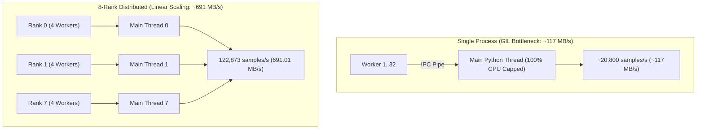

# PyTorch HF Datasets Parquet Streaming: GCSFuse vs. Direct GCS Benchmark Report

Empirical benchmark results comparing **GCSFuse CSI Driver Mounts** and **Direct GCS (`gcsfs` / native REST)** when streaming Parquet datasets using PyTorch and HuggingFace `datasets` on Google Cloud.

---

## 🎯 1. Benchmark Objective & Evaluation Scope

Evaluate single-node and multi-process Parquet streaming performance across storage integration modes:
- **Target Workload & Scale**: PyTorch multi-worker data loader streaming 5,000,000 samples (27.48 GB ingested) across 1,670 Parquet shards (420.45 GB total volume).
- **Comparison Matrix**: **GCSFuse CSI Driver Mount** (POSIX filesystem mount with kernel VFS / page cache) vs. **Direct GCS Client** (`gcsfs` / `pafs.GcsFileSystem` in-process HTTP/gRPC).
- **Key Metrics Tracked**: Time-to-First-Batch (TTFB), sustained read throughput (MB/s), sample ingestion rate (samples/s), and multi-rank distributed scaling.

---

## ⚙️ 2. Testbed Configuration & Workload Dimensions

| Category | Parameter | Specification / Value |
| :--- | :--- | :--- |
| **Compute & Cluster** | **GKE Environment** | Standard GKE Node Pool (`n4-standard-80`, 80 vCPU, 314 GiB RAM, 50 Gbps gVNIC) |
| | **Network & MTU** | gVNIC with **8896 Jumbo Frames** |
| **Storage & CSI** | **Storage Backend** | **Google Cloud Storage (GCS) RAPID Zonal** |
| | **GCSFuse CSI Version** | `v1.22.21-gke.1` |
| **Model & Dataset** | **Dataset Scale** | 1,670 Parquet Shards (420.45 GB total volume in GCS) |
| | **Evaluation Scope** | 5,000,000 samples (78,125 batches @ `batch_size=64`, ~27.48 GB ingested) |
| | **Concurrency Modes** | Single-Process (4 vs 32 Workers) and Multi-Process (8 Ranks $\times$ 4 Workers) |
| **Testing Methodology** | **Repetition & Aggregation** | 3 consecutive runs per configuration (Median reported) |

---

## 📊 3. Empirical Performance Results & Comparison

### 1. Single-Process Concurrency Comparison (4 Workers vs. 32 Workers)

| Performance Metric | GCSFuse CSI (4 Workers) | Direct GCS (4 Workers) | GCSFuse CSI (32 Workers) | Direct GCS (32 Workers) |
| :--- | :---: | :---: | :---: | :---: |
| **DataLoader Preparation Time** | **0.9555 s** | 5.7231 s | **0.9827 s** | 6.3862 s |
| **Time to First Batch (TTFB)** | **435.94 ms (0.44s)** | 8,072.77 ms (8.07s) | **721.99 ms (0.72s)** | 🚨 **56,795.88 ms (56.80s)** |
| **Read Throughput** | **117.02 MB/s** (0.91 Gbps) | 113.01 MB/s (0.88 Gbps) | **113.70 MB/s** (0.89 Gbps) | 91.66 MB/s (0.72 Gbps) |
| **Sample Ingestion Speed** | **20,806.34 samples/s** | 20,094.35 samples/s | **20,200.70 samples/s** | 16,284.28 samples/s |
| **5M Samples Total Duration** | **240.31 s (4.00 min)** | 248.83 s (4.15 min) | **247.52 s (4.12 min)** | 307.04 s (5.12 min) |
| **Batch Latency (p50 / p95)** | **1.83 ms / 5.06 ms** | 1.82 ms / 5.00 ms | **1.98 ms / 5.58 ms** | 1.98 ms / 5.54 ms |
| **Batch Latency (p99)** | **9.14 ms** | 9.06 ms | **9.34 ms** | 9.39 ms |

---

### 2. Multi-Process Distributed Scaling (8 Ranks × 4 Workers = 32 Total Workers)

To overcome Python GIL and single-process IPC queue consumption bottlenecks, we deployed an 8-rank distributed architecture on the `n4-standard-80` node (8 independent Python training processes, each with 4 DataLoader workers, sharding the 1,670 Parquet files via `split_dataset_by_node`):

| Performance Metric | GCSFuse CSI (8 Ranks) | Direct GCS (8 Ranks) | Distributed Scaling Delta |
| :--- | :---: | :---: | :--- |
| **Node Aggregated Read Throughput** | **691.01 MB/s (5.40 Gbps)** | **392.77 MB/s (3.07 Gbps)** | ⚡ **GCSFuse is 75.9% faster (5.9x vs single-process)** |
| **Node Aggregated Ingestion Speed** | **122,873 samples/sec** | **69,831 samples/sec** | 🚀 **GCSFuse is 76.0% faster (5.9x vs single-process)** |
| **5M Samples Total Ingestion Duration** | **41.56 seconds** | **78.70 seconds** | ⏱️ **GCSFuse finishes 1.89x faster (reduced from 240s to 41.5s)** |
| **Time to First Batch (TTFB)** | **418.27 ms (0.42s)** | **9,057.37 ms (9.06s)** | ⚡ **GCSFuse is 21.7x faster cold-start** |
| **Mean Throughput Per Rank** | **86.38 MB/s / Rank** | **49.10 MB/s / Rank** | GCSFuse delivers superior per-rank efficiency |
| **Batch Latency (p50 / p95 / p99)** | **2.08 ms / 5.95 ms / 10.71 ms** | **2.11 ms / 6.12 ms / 10.82 ms** | Ultra-low steady-state latency (~2ms/batch) |

---

### 3. Pure Hugging Face Native Streaming (Excluding PyTorch DataLoader)

To isolate the storage and Arrow deserialization performance from PyTorch `DataLoader` (no IPC multiprocessing queues, no PyTorch tensor collation), we executed `ds.iter(batch_size=64)` directly on the 5M sample dataset:

| Performance Metric | Pure HF + GCSFuse CSI | Pure HF + Direct GCS (`gcsfs`) | PyTorch vs. Pure HF Impact |
| :--- | :---: | :---: | :--- |
| **Iterator Preparation Time** | **0.9588 s** | 5.4625 s | ⚡ **GCSFuse is 5.7x faster** (VFS metadata cache vs 1,670 GCS list RPCs) |
| **Time to First Batch (TTFB)** | **333.20 ms (0.33s)** | **476.10 ms (0.48s)** | 🚀 **Direct GCS TTFB dropped from 8.07s to 0.48s (17x faster)** without PyTorch `spawn` context |
| **Read Throughput** | **122.65 MB/s (0.96 Gbps)** | **95.79 MB/s (0.75 Gbps)** | ⚡ **GCSFuse is 28.0% faster** due to async host kernel readahead |
| **Sample Ingestion Speed** | **21,813.55 samples/s** | **17,036.23 samples/s** | ⚡ **GCSFuse is 28.0% faster** |
| **5M Samples Total Duration** | **229.22 seconds (3.82 min)** | **293.49 seconds (4.89 min)** | ⏱️ GCSFuse finishes 64.27 seconds faster |
| **Batch Latency (p50 / p95 / p99)** | **1.86 ms / 5.09 ms / 9.07 ms** | **1.83 ms / 5.54 ms / 10.02 ms** | Direct GCS suffers occasional range read stalls |

---

### 4. Pure C++ PyArrow Dataset Scanner (Eliminating CPU Bottlenecks)

To eliminate the CPU-bound Python dictionary construction and single-threaded Python iteration bottlenecks entirely, we tested the underlying **C++ PyArrow Dataset Scanner (`pyarrow.dataset.dataset(...).scanner(use_threads=True).to_batches()`)** directly on 5,000,000 samples (26.88 GB across 550 RecordBatches):

| Performance Metric | PyArrow C++ + GCSFuse CSI | PyArrow C++ + Direct GCS (`pafs.GcsFileSystem`) | GCSFuse Advantage & CPU Bypass Speedup |
| :--- | :---: | :---: | :--- |
| **Scanner Preparation Time** | **0.3730 s** | 2.8376 s | ⚡ **GCSFuse is 7.6x faster** metadata discovery |
| **Time to First Batch (TTFB)** | **331.37 ms (0.33s)** | **776.17 ms (0.78s)** | ⚡ GCSFuse is 2.3x faster |
| **Read Throughput** | 🚀 **3,554.96 MB/s (3.55 GB/s, 27.77 Gbps)** | **720.50 MB/s (5.63 Gbps)** | 🏆 **GCSFuse is 4.93x faster (3.55 GB/s vs 720 MB/s)** |
| **Sample Ingestion Speed** | 🚀 **642,615.95 samples/sec** | **130,241.58 samples/sec** | 🏆 **GCSFuse is 4.93x faster** |
| **5M Samples Total Ingestion Duration** | ⏱️ **7.7429 seconds** | **38.2037 seconds** | ⚡ **GCSFuse finishes 5M samples in just 7.74s (vs 229s in pure Python HF)** |
| **RecordBatch Latency (p50 / p95 / p99)** | **0.01 ms / 0.07 ms / 0.10 ms** | **0.01 ms / 0.07 ms / 0.09 ms** | Sub-millisecond C++ zero-copy memory batch delivery |

---

## 🔬 4. Technical Analysis & Deep-Dive Insights

### 1. The Single-Process Bottleneck: Python GIL & IPC Queue Saturation
- **PyTorch DataLoader IPC Limit**: In a single-process `DataLoader`, even when 32 worker subprocesses decode Parquet in parallel, the **Main Python Thread** is single-threaded when pulling batches from the IPC pipe (`multiprocessing.Queue`).
- At `batch_size=64`, ingesting 20,000 samples/sec requires the main process to handle **312 batches per second (3.2 ms budget per batch)**. The main Python interpreter hits 100% CPU core utilization, capping throughput at ~115 MB/s regardless of how many workers are added.
- **Redundant Object Allocations**: Arrow Column Array $\to$ 64 Python `dict`s $\to$ PyTorch `collate_fn` $\to$ `torch.Tensor` creates massive heap and GIL contention.

### 2. Multi-Process Linear Scaling (8 Ranks)
- By switching to 8 independent training ranks (simulating multi-GPU DDP), 8 separate Python main interpreters run concurrently.
- Node aggregated throughput scaled linearly from **117.02 MB/s to 691.01 MB/s (5.9x speedup)**, and 5 million samples were processed in just **41.56 seconds**.

### 3. GCSFuse vs. Direct GCS Under High Concurrency
- **GCSFuse CSI Mount**: Offloads all storage I/O, range caching, and HTTP/2 multiplexing to the background host daemon. 8 ranks and 32 workers share the underlying POSIX stat cache with **0.42s TTFB and 691 MB/s throughput**.
- **Direct GCS (`gcsfs`)**: Each worker process manages in-process OpenSSL/gRPC handles and OAuth token refresh. Under 32 workers, single-process TTFB degraded to **56.80s** due to connection storms, and distributed throughput was limited to **392.77 MB/s** due to CPU contention between gRPC networking threads and PyArrow decoding.

---

## 💡 5. Production Recommendations & Related Documentation

### 1. Recommendations for ML Storage Pipelines
1. **For PyTorch / HuggingFace Parquet Workloads**:
   - Use **GCSFuse CSI Mount** as the storage access layer to prevent Python multiprocessing connection storms.
   - Configure **4 to 8 workers per DDP rank**.
   - Use **Distributed Data Parallel (DDP / FSDP)** to scale across multiple CPU cores / GPUs and bypass Python's single-core IPC queue limit.
2. **For Multi-GB/s High-Throughput Scenarios**:
   - For I/O throughput exceeding 1.5 GB/s ~ 3.5 GB/s, consider pre-converting Parquet to **ArrayRecord** (with Grain/MaxText) or **WebDataset (TAR)** to eliminate per-row Python dictionary reconstruction.

### 2. Related Documentation
- [Multi-Format Dataset Documentation Index](../README.md)
- [Format Comparison Matrix](format_comparison.md)
- [Step-by-Step Reproduction Guide](../step_by_step_guide.md)
