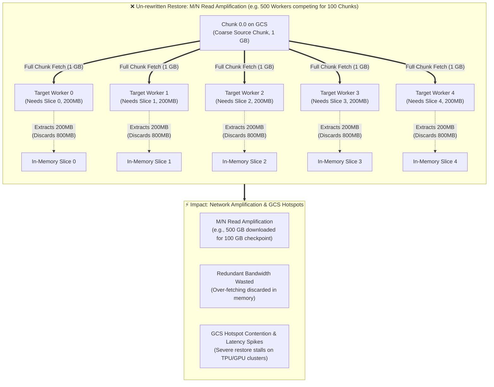
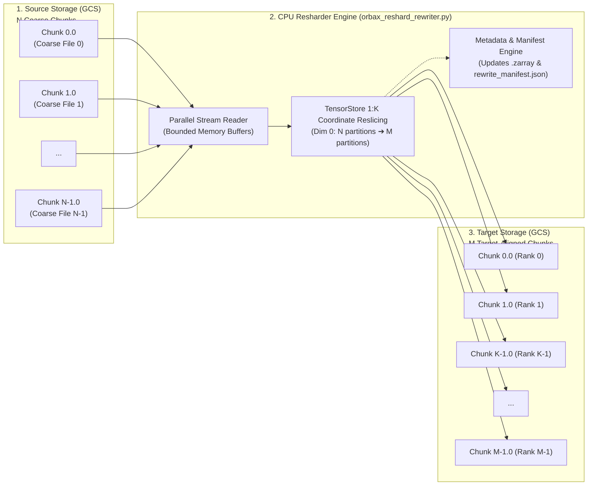
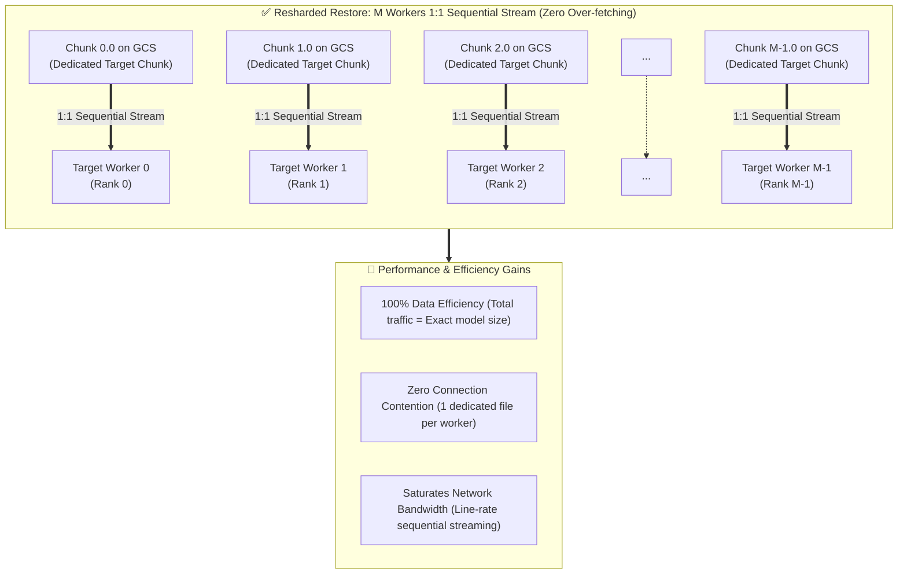

# Orbax & TensorStore Checkpoint Resharding and Restore Benchmark

A comprehensive architectural guide and cloud-native benchmark suite for **Orbax & TensorStore checkpoint offline resharding, topology adaptation, and restore acceleration** on Google Cloud Platform (GCP), Google Kubernetes Engine (GKE), and Google Cloud Storage (GCS / GCSFuse).

---

## 📖 Background & Problem: Chunk Atomicity & Read Amplification

### 1. Distributed Checkpoint Storage Mechanism (Zarr Chunk Architecture)
In large-scale distributed pre-training with JAX, MaxText, or PyTorch FSDP, weight tensors (e.g. attention and MLP matrices) are saved directly to Cloud Storage via **Orbax + TensorStore (Zarr format)**:
- **Tensor Sharding in Distributed Training**: Multi-dimensional weight tensors are partitioned across $N$ accelerator devices along sharded axes (e.g., Dim 0 for FSDP / Data Parallelism).
- **Zarr Chunk-Based Grid**: TensorStore represents large multidimensional arrays by dividing them into a regular grid of physical chunks.
- **Chunk as the Atomic I/O Unit**: Each chunk is stored as an independent physical file on Cloud Storage (e.g., `0.0`, `1.0`, ..., `N-1.0`). In the Zarr format and TensorStore driver, the **Chunk is the minimum atomic unit for storage indexing, network fetching, and data decompression**.
- **Source Shard Topology ($N$ Physical Chunks)**: A training job running on $N$ worker ranks writes $N$ physical chunk files per partitioned matrix directly to GCS.

> [!NOTE]
> **Illustrative Example Scenario**: Consider a 100 GB model checkpoint saved across $N = 100$ TPU chips. TensorStore saves 100 physical chunk files (`0.0` ~ `99.0`), with each chunk file sized at **~1 GB**, written directly to Cloud Storage.

```
【Source Checkpoint: N-Shard Training Save (e.g., N=100 ranks, 100 GB Total)】
Layer_00/q_proj:
  ├── .zarray (shape=[16384, 16384], chunks=[Dim0/N, 16384])
  ├── 0.0     (Written by Rank 0, ~1 GB)
  ├── 1.0     (Written by Rank 1, ~1 GB)
  └── ... 99.0 (Written by Rank 99, ~1 GB)
```

---

### 2. Topology Resharding: Why Direct Restore Triggers Read Amplification

When restoring checkpoints on a different cluster topology (e.g. scaling up from $N$ source chips to $M$ target workers, where $M > N$):

#### 🚨 The Core Conflict: Chunk Atomicity vs. Slice Requests
- **Target Slice Requirements**: Each of the $M$ target workers only requires a fine-grained $1/M$ slice of the model parameters.
- **No Selective Byte-Range Reads**: In TensorStore's Zarr driver, **workers cannot selectively range-read a partial byte slice directly from inside a coarse chunk file over the network**. Whether due to block compression or chunk-level indexing, TensorStore must **fetch and load the entire chunk file into host memory** before extracting the requested slice.
- **Read Amplification ($M/N \times$ Over-Fetching)**:
  - When $M > N$, each coarse source chunk intersects with $K = M/N$ target workers.
  - All $K$ workers independently fetch the full coarse chunk file from GCS, resulting in an **$M/N \times$ Read Amplification** (with $(1 - N/M)$ of total network bandwidth wasted on redundant data discarded after in-memory slicing).
- **GCS Object Contention & Latency Spikes**:
  - Multiple workers simultaneously pull the exact same physical GCS object, creating hot-spot connection contention, TCP/gRPC socket queueing, and GCS rate limiting.
  - Checkpoint restore duration surges significantly, causing severe restore latency spikes and idling expensive accelerator clusters (TPU/GPU) during critical recovery windows.

#### 💡 Concrete Example Walkthrough ($N=100 \to M=500$, $5\times$ Read Amplification)
- **Slice Request**: 500 target workers each need a 200 MB slice ($100\text{ GB} / 500 = 200\text{ MB}$).
- **Chunk Conflict**: Workers 0 through 4 all intersect with `Chunk 0.0` (1 GB) and each download the full 1 GB file.
- **Amplification**: Single 1 GB chunk produces $5 \times 1\text{ GB} = 5\text{ GB}$ network download. Across the cluster, **$500\text{ GB}$ of data is downloaded for a $100\text{ GB}$ model** (400 GB redundant bandwidth wasted).



---

## 🛠️ Solution: Offline CPU Resharding Transformation

To eliminate read amplification and GCS hotspot contention, we run a fast, one-time offline resharding step on cost-effective CPU nodes using [`tools/checkpoints/orbax_reshard_rewriter.py`](../../tools/checkpoints/orbax_reshard_rewriter.py).

### 1. Resharding Workflow & Pipeline Architecture

The offline rewriter transforms the checkpoint geometry from coarse source shards ($N$) into target-aligned shards ($M$):
1. **Parallel Streaming Ingestion**: A multi-threaded worker pool reads source arrays in bounded streaming slice buffers, maintaining a flat memory footprint without loading entire weight tensors into host RAM.
2. **Physical Chunk Decomposition ($N \to M$)**: Re-partitions the tensor coordinate space along the sharded dimension, dividing each coarse source chunk into $K = M/N$ fine-grained target chunks.
3. **Zarr Metadata & Manifest Generation**: Updates the Zarr `.zarray` chunk geometry (`chunks: [Dim0/M, ...]`) to match the new target layout and commits an audit manifest (`rewrite_manifest.json`).
4. **Sequential High-Throughput Write**: Streams the newly partitioned target chunks directly to Cloud Storage via GCSFuse at sequential line-rate throughput.



---

### 2. Physical Chunk Decomposition Mapping (Example: 100 Chunks ➔ 500 Chunks)

The following mapping illustrates a concrete scenario decomposing $N = 100$ coarse chunks (1 GB each) into $M = 500$ dedicated target chunks (200 MB each):

| Source Chunk ($N=100$, 1 GB each) | Target Chunks ($M=500$, 200 MB each) | Assigned Target Worker Rank | Read Pattern During Restore | Network Transfer per Worker |
| :--- | :--- | :--- | :--- | :--- |
| **`Chunk 0.0` (1 GB)** | `Chunk 0.0` (200 MB)<br/>`Chunk 1.0` (200 MB)<br/>`Chunk 2.0` (200 MB)<br/>`Chunk 3.0` (200 MB)<br/>`Chunk 4.0` (200 MB) | Worker 0 (Rank 0)<br/>Worker 1 (Rank 1)<br/>Worker 2 (Rank 2)<br/>Worker 3 (Rank 3)<br/>Worker 4 (Rank 4) | **1:1 Full File Sequential Stream** | **200 MB** (100% efficient, 0% waste) |
| **`Chunk 1.0` (1 GB)** | `Chunk 5.0` ~ `9.0` (200 MB each) | Workers 5 ~ 9 | **1:1 Full File Sequential Stream** | **200 MB** (100% efficient) |
| **...** | **...** | **...** | **...** | **...** |
| **`Chunk 99.0` (1 GB)** | `Chunk 495.0` ~ `499.0` (200 MB each) | Workers 495 ~ 499 | **1:1 Full File Sequential Stream** | **200 MB** (100% efficient) |

---

### 3. Accelerated Target Restore: 1:1 Sequential Streaming & Zero Over-Fetching

After offline resharding, when the target cluster ($M$ workers) initializes:
1. **1:1 Target Worker Alignment**: Each of the $M$ target workers opens its own dedicated chunk file (`0.0` to `M-1.0`).
2. **Zero Read Amplification (100% Data Efficiency)**: Total network traffic across the cluster matches the exact logical checkpoint size (100% of downloaded bytes are used).
3. **Zero Hotspot Contention**: No two workers access the same GCS object; each worker downloads its own file independently.
4. **Bandwidth Saturation**: GCSFuse and OS read-ahead buffers achieve full network line-rate throughput by downloading contiguous large chunk files.



---

## 📊 Benchmark Test Results

The empirical results from cloud testing on GKE + GCS RAPID Zonal are documented in our consolidated evaluation report:

- [100GB Checkpoint Resharding & Restore Acceleration Benchmark Report](results/100gb_restore_acceleration.md)
  - **Restore Acceleration**: 5-shard source $\to$ 10 target workers (112.0 GB checkpoint), 24.74s wall time (1.35x speedup, 25.8% time saved), 4,635.83 MB/s effective throughput.
  - **Physical Shard Breakdown**: Structural breakdown across 112 TensorStore arrays, 560 vs 1,120 chunk files, and Zarr metadata layout.
  - **CPU Rewriter Efficiency**: 1.82 GB/s sustained write throughput, entire 112 GB rewritten in 63.14s with peak host RAM < 1.20 GB.

---

## 📖 Step-by-Step Guides & Deployment

- [Step-by-Step Reproduction Guide](step_by_step_guide.md): Complete instructions for deploying the automated benchmark harness via Helm on GKE.
- [Workload Quickstart & Helm Values Reference](../../workloads/orbax-checkpoint-benchmark/README.md): Operator guide for running CLI tools and configuring Helm charts.

