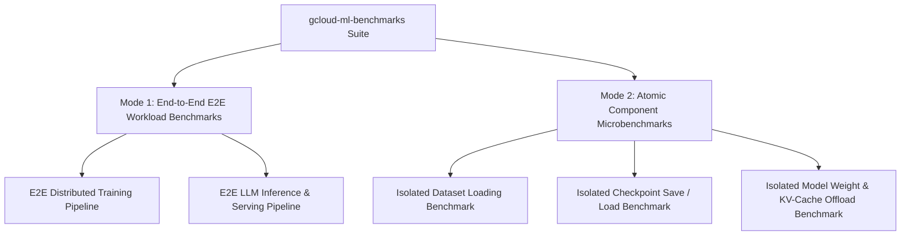
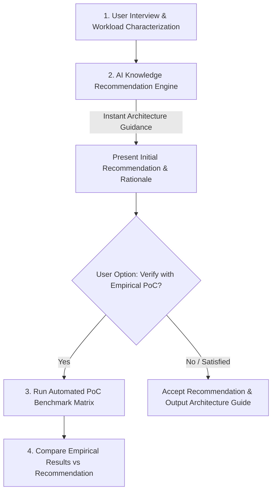

# Product Vision & Future Development Roadmap: `gcloud-ml-benchmarks`

`gcloud-ml-benchmarks` is an open-source, AI Agent-driven benchmarking and PoC harness for Machine Learning I/O performance on Google Cloud Platform (GCP) and Google Kubernetes Engine (GKE).

---

## 🎯 Product Mission & Core Value Proposition

1. **For GCP Customers**: Provides an interactive, zero-friction AI Agent assistant that automates real-world ML storage PoCs and performance benchmarks to guide architecture selection (Google Cloud Storage vs. Managed Lustre).
2. **For ML Platform & Data Engineers**: Delivers reproducible reference implementations for optimizing dataset ingestion, model checkpointing, and LLM serving I/O.

---

## 🏗️ Two Core Testing Paradigms

To satisfy both high-level workload evaluation and deep component-level I/O profiling, the platform supports two distinct testing modes:



### Paradigm 1: End-to-End (E2E) Macrobenchmarks & PoCs
Evaluates complete, multi-step ML pipelines under realistic production conditions.

| Test Scenario | Target Frameworks | Key Metrics Evaluated |
| :--- | :--- | :--- |
| **E2E Distributed Training** | PyTorch DDP / FSDP, JAX / MaxText, Megatron-LM | Overall step time, epoch throughput, total time-to-train, checkpoint stall overhead |
| **E2E LLM Serving / Inference** | vLLM, TensorRT-LLM, Ray Serve | Cold-start latency, Time-To-First-Token (TTFT), inter-token latency, request throughput |

---

### Paradigm 2: Atomic Component Microbenchmarks
Isolates specific I/O sub-systems to pinpoint storage bottlenecks without compute noise.

| Microbenchmark Type | Sub-system Profiled | Key Metrics Evaluated |
| :--- | :--- | :--- |
| **1. Dataset Loading** | Parquet, TFRecord, WebDataset, Zarr array streaming | Dataloader initialization latency, MB/s read throughput per worker thread, scaling across nodes |
| **2. Checkpoint Save & Restore** | PyTorch state dicts (`.pt`), Safetensors, JAX Orbax | In-memory serialization (pickle) latency, raw network write speed (MB/s & Gbps), resume/recovery time |
| **3. Model Weight & KV-Cache I/O** | LLM weight loading (`.safetensors`), KV-cache offloading | Cold-start weight load latency, random-access read bandwidth, KV-cache swapping throughput |

---

## 📐 Workload Characterization & Decision Support Taxonomy

To map a user's business requirements to the correct benchmark/PoC workload, the AI Agent characterization engine interviews the user across 10 core dimensions. If certain choices are unknown or unconfirmed by the customer, the AI Agent flags them as **"Exploratory Decision Parameters"** and automatically runs sweep benchmarks to guide decision-making:

| Dimension | Description & Options | Impact on Storage & I/O |
| :--- | :--- | :--- |
| **1. Workload Phase** | Training / Fine-tuning vs LLM Inference / Serving | Training stresses write throughput (checkpoints); Inference stresses read latency & random access |
| **2. Model Architecture & Size** | Parameter count (8B, 70B, 405B) & precision (BF16, FP8) | Determines checkpoint file size (~2GB per 1B BF16 params; ~8GB with AdamW state dicts) |
| **3. ML Framework** | PyTorch (DDP/FSDP), JAX (MaxText), Megatron, vLLM | Determines dataset loader API, checkpoint serialization format, and parallelism hooks |
| **4. Accelerator Spec** | GPUs (H100, A100, L4) vs TPUs (v5p, v5e) vs CPU emulators | Defines compute compute node throughput, network NIC bandwidth, and host memory limits |
| **5. Cluster Scale** | Node count (1, 8, 32, 128) & ranks per node | Determines concurrent read/write I/O pressure on storage targets |
| **6. Parallelism Strategy** | Tensor (TP), Pipeline (PP), Data (DP), FSDP / ZeRO-3 | Dictates shard distribution and per-rank checkpoint write file count |
| **7. Dataset Format & Scale** | Parquet, WebDataset (`.tar`), TFRecord, Zarr, raw images | Governs dataloader thread count, small-file IOPS vs large-file throughput requirements |
| **8. Checkpoint Config** | Frequency (every N steps/mins), format (`.pt`, Safetensors, Orbax) | Governs burst I/O write requirements and training stall sensitivity |
| **9. Target Storage Solution** | Google Cloud Storage (GCSFuse / `gcsfs`) vs Managed Lustre | Governs CSI driver selection, mount options, and PV/PVC provisioning |
| **10. Exploratory Parameters** | Parameters marked **"TBD by PoC"** (e.g. Lustre vs GCSFuse choice) | Triggers the AI Agent to construct comparative sweep matrix runs to resolve customer uncertainty |

---

## 🧠 Two-Stage Decision Architecture: Instant Knowledge Recommendation -> Empirical PoC Verification

Rather than forcing users to run cloud benchmarks blindly, the system employs a two-stage decision loop:



### Stage 1: AI Knowledge-Driven Recommendation Engine (Zero Latency)
- Immediately synthesizes collected workload dimensions against GCP storage domain knowledge:
  - **GCSFuse Streaming Writes**: Best for cost-effective streaming datasets and checkpoints up to ~600-800 MB/s per node.
  - **Google Cloud Managed Lustre**: Recommended when per-node write throughput exceeds 1 GB/s, or when POSIX lock/metadata IOPS requirements are high.
  - **`gcsfs` Direct API**: Recommended for Python-native dataloading without FUSE kernel overhead.
- Outputs an instant **Initial Recommendation Matrix** highlighting expected performance, cost tradeoffs, and potential bottlenecks before spinning up any infrastructure.

### Stage 2: Empirical PoC Verification & Tuning (On-Demand Validation)
- Asks the user: *"Would you like to run an automated PoC benchmark matrix to empirically validate this recommendation on your GKE cluster?"*
- If approved, executes the test matrix, measures actual throughput/latency numbers, and produces a final validation report comparing theoretical expectations against empirical results.

---

## 💾 Storage System Abstraction Layer

Focuses on the two primary GCP high-throughput storage solutions:

1. **Google Cloud Storage (GCS)**:
   - **GCSFuse Streaming Writes** (`GcsFuseCsiDriver` with memory-buffered streaming writes).
   - **Direct GCS REST API** (`gcsfs` / `fsspec` Python client).
2. **Google Cloud Managed Lustre**:
   - High-performance parallel file system (`LustreCsiDriver` POSIX mounts).

---

## 🤖 Modular AI Agent Skill Architecture

The platform uses 4 decoupled AI Agent Skills to orchestrate workflows interactively:

```text
skills/
├── ml-benchmark-orchestrator/   # Master Orchestrator: Interactive interview, mode selection (E2E vs Atomic), plan approval
├── gcp-resource-provisioner/    # Resource Setup: Auto-discovery or provisioning GKE, Lustre PVC, GCS buckets & IAM
├── helm-workload-runner/        # Workload Execution: Helm flag construction, async Pod tracking, release teardown
└── benchmark-metrics-parser/    # Performance Analysis: Container log parsing, multi-run statistics (mean/stddev), Markdown reports
```

---

## 🗺️ Phased Implementation Roadmap

### Phase 1: Foundation & PyTorch/TensorStore Support (Current Status)
- [x] PyTorch DDP Llama 3.1 8B CPU emulator harness.
- [x] TensorStore / Zarr multi-node array I/O harness.
- [x] Step-by-step reproduction guides for Managed Lustre, GCSFuse, and `gcsfs`.
- [x] Modular 4-skill AI Agent automation suite with plan review and safety guardrails.

### Phase 2: Atomic Microbenchmarks & Empirical Tuning Validation (Next Target)
- [ ] Dedicated **Atomic Dataset Loader Microbenchmark** (benchmarking Parquet / WebDataset read bandwidth).
- [ ] Dedicated **Atomic Checkpoint Save/Restore Microbenchmark** (benchmarking Safetensors / PyTorch checkpointing).
- [ ] Enhanced multi-run matrix statistics (automatic speedup calculations, mean $\pm$ stdev reporting).
- [ ] **Empirical Validation Suite for Knowledge Base Tuning Parameters**:
  - [ ] **VPC MTU 8896 (Jumbo Frames) vs MTU 1460**: Empirically measure throughput impact on Managed Lustre to verify the claimed +10% gain.
  - [ ] **GCSFuse `enable-streaming-writes=true` vs Local Staging**: Measure disk latency and RAM consumption difference.
  - [ ] **GCSFuse `metadata-cache:negative-ttl-secs=0`**: Validate IOPS improvement during high-frequency checkpoint creation.
  - [ ] **GKE `TIER_1` Networking Scaling**: Profile egress throughput across 16, 32, 64, and 80 vCPU instance types (`n4-standard-80` vs `c4-standard-192`).
- [ ] **Knowledge Base Expansion & Self-Evolving Feedback Loop**:
  - [ ] **Automated Post-Run Metric Feedback Loop**: Automatically extract and append new benchmark runs into `docs/knowledge_base/empirical_results_matrix.json`.
  - [ ] **Troubleshooting & Gotchas Knowledge Base**: Add diagnostic guides for GCSFuse OOM, Lustre PVC timeout, Workload Identity 403, and fallback patterns.
  - [ ] **Community & Customer Benchmark Submissions**: Provide templates for community contributions on GPU/TPU clusters.

### Phase 3: E2E LLM Inference & Framework Expansion (Future Horizon)
- [ ] **vLLM / Serving Weight Loading Benchmark** (measuring GCS vs. Lustre model cold-start time).
- [ ] **JAX / MaxText Integration** for TPU/GPU large-scale training benchmarks.
- [ ] Automated BigQuery performance ingestion & dashboard visualization.
