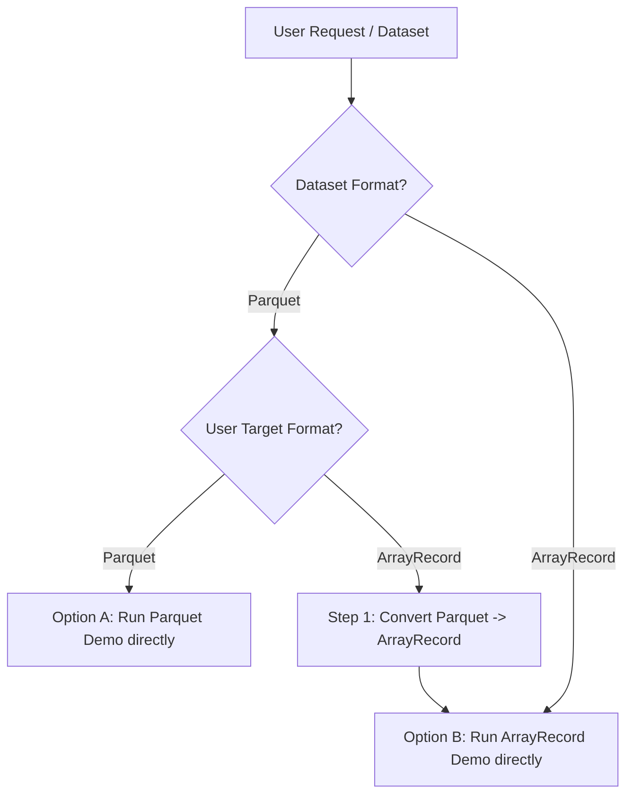

# MaxText Dataset Benchmark & Conversion Skill (`maxtext-dataset-benchmark`)

This skill enables an AI Agent to execute MaxText dataset loading demos on GKE using **either Parquet or ArrayRecord** formats. 

If a user provides a Parquet dataset and wants to test or evaluate ArrayRecord, an optional conversion tool (`parquet_to_arrayrecord.py`) is provided to pre-tokenize and convert Parquet shards into ArrayRecord before running the benchmark.

---

## 🎯 Format Selection & Decision Workflow

When the user asks to run the MaxText dataset benchmark or demo:



---

## 🛠️ Step-by-Step Execution Protocols

### Option A: Direct Parquet Loader Demo (`format=parquet`)
Use when testing existing Parquet datasets with GCS Range Reads and on-the-fly tokenization:

```bash
cd workloads/maxtext-parquet-loader/helm_chart
helm install maxtext-demo-run . \
  --set gcsfs.datasetPath="${DATASET_PATH}" \
  --set workload.datasetFormat="parquet" \
  --set workload.shuffleMode="${SHUFFLE_MODE:-two_stage}" \
  --set workload.batchSize=64 \
  --set workload.maxBatches=100
```

---

### Option B: Direct ArrayRecord Loader Demo (`format=arrayrecord`)
Use when testing pre-tokenized ArrayRecord datasets for sub-millisecond batch latencies:

```bash
cd workloads/maxtext-parquet-loader/helm_chart
helm install maxtext-demo-run . \
  --set gcsfs.datasetPath="${ARRAYRECORD_DATASET_PATH}" \
  --set workload.datasetFormat="arrayrecord" \
  --set workload.convertToArrayRecord=false \
  --set workload.shuffleMode="${SHUFFLE_MODE:-two_stage}" \
  --set workload.batchSize=64 \
  --set workload.maxBatches=100
```

---

### Option C: Optional Parquet to ArrayRecord Conversion & Demo
If the user **only has a Parquet dataset** but wants to evaluate or switch to **ArrayRecord**:

#### 1. Convert Parquet Shards to ArrayRecord:
```bash
python3 workloads/maxtext-parquet-loader/helm_chart/parquet_to_arrayrecord.py \
  --input-path="${INPUT_PARQUET_PATH}" \
  --output-path="${OUTPUT_ARRAYRECORD_PATH}" \
  --sequence-length=${SEQUENCE_LENGTH:-2048} \
  --max-files=${MAX_FILES:-20}
```
*Note*: Supports GCS RAPID zonal storage buckets (`gs://...`) via `gcsfs` appendable streaming writes.

#### 2. Run ArrayRecord Demo on Converted Data:
```bash
cd workloads/maxtext-parquet-loader/helm_chart
helm install maxtext-demo-run . \
  --set gcsfs.datasetPath="${OUTPUT_ARRAYRECORD_PATH}" \
  --set workload.datasetFormat="arrayrecord" \
  --set workload.convertToArrayRecord=false \
  --set workload.shuffleMode="${SHUFFLE_MODE:-two_stage}" \
  --set workload.batchSize=64 \
  --set workload.maxBatches=100
```

---

## 📊 Milestone Monitoring & Performance Validation

Monitor pod execution and parse summary logs:

```bash
# Check pod status
kubectl get pods -l jobset.sigs.k8s.io/jobset-name=maxtext-demo-run

# Stream benchmark output
kubectl logs pod/${POD_NAME} --tail=40
```

Verify key metrics in output:
- **Data Format**: `PARQUET` vs `ARRAYRECORD`
- **Time to First Batch (TTFB)** (ms)
- **Upfront Index Scanning Penalty** (ms)
- **Batch Load Latency Percentiles** (`p50`, `p95`, `p99` ms)
- **Sample Ingestion Speed** (samples/sec)

---

## 🧹 Cleanup & Teardown Protocol

Always uninstall the Helm release when benchmark execution is complete or aborted:

```bash
helm uninstall maxtext-demo-run --ignore-not-found
```
