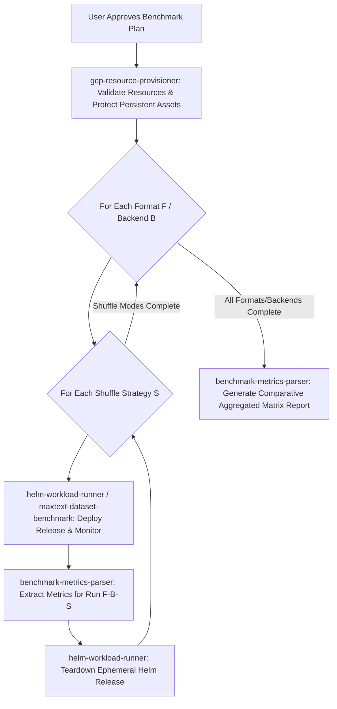

# ML Benchmark Orchestrator Skill (`ml-benchmark-orchestrator`)

This is the master orchestration skill for all ML storage, data loader, and model training benchmarks across `gcloud-ml-benchmarks`. It references persistent baseline benchmarks and GCP storage domain knowledge located in [references/gcp_ml_storage_reference.md](references/gcp_ml_storage_reference.md).

---

## ⛔ CRITICAL RULE 1: INTERACTIVE ALIGNMENT FIRST (UNIVERSAL DEMO PROTOCOL)

**NEVER start executing shell commands, creating resources, or deploying workloads immediately after receiving a request.**

Your **VERY FIRST ACTION** for any demo or benchmark request must be to conduct an interactive alignment interview with the user. Use structured prompts or `ask_question` to confirm every key aspect of the workload and target options.

---

## 🔒 CRITICAL RULE 2: STRICT PERSISTENT RESOURCE PROTECTION

**NEVER delete, modify, or tear down user-supplied persistent resources.**

- **PERSISTENT ASSETS (DO NOT DELETE)**: Existing GKE clusters, existing Managed Lustre instances/PVCs, and existing GCS buckets supplied by the user.
- **EPHEMERAL BENCHMARK ASSETS (CLEAN UP AFTER RUN)**: Helm workload releases (`helm uninstall <RELEASE_NAME>`) created for the benchmark run.

---

## ⏳ CRITICAL RULE 3: COMPLETE WORKLOAD MONITORING (DO NOT PREMATURELY TEARDOWN)

**NEVER uninstall or terminate benchmark releases while pods are still in `Running` or `ContainerCreating` status.**

- Always poll `kubectl get pods` until **ALL** workload pods in the active benchmark matrix have reached `Completed` status (or a strict maximum timeout is exceeded).
- Only parse logs and teardown ephemeral Helm releases AFTER 100% of workload pods have finished execution.

---

## 🛠️ ENVIRONMENT PRE-FLIGHT DIAGNOSTICS & AUTOMATED SETUP

Before launching benchmark workloads, the Orchestrator MUST perform pre-flight checks and automatically guide or apply remediation for missing components:

### 1. Local CLI & Tool Check:
- **`gcloud`**: Verify active account (`gcloud auth list`) and project setting (`gcloud config get-value project`).
- **`kubectl`**: Verify cluster connectivity (`kubectl config current-context`).
- **`helm`**: Verify Helm v3 installation (`helm version`).
- **`node`**: Verify Node.js runtime for telemetry/plugin hooks (`node -v`). *Remediation: `sudo apt-get install -y nodejs`*.

### 2. GKE Cluster Capabilities Check:
- **GKE Kubelet & Master Version**: Verify GKE version (`kubectl get nodes -o jsonpath='{.items[0].status.nodeInfo.kubeletVersion}'`).
- **GCSFuse CSI Driver & Image Version**: Verify if `gcsfuse.csi.storage.gke.io` is enabled and extract driver image tag version (`kubectl get daemonset gke-gcsfuse-csi-node -n kube-system -o jsonpath='{.spec.template.spec.containers[0].image}'`).
  - *Remediation Command*: `gcloud container clusters update <CLUSTER> --region <REGION> --update-addons GcsFuseCsiDriver=ENABLED`
- **VPC Network MTU Configuration**: MUST dynamically query the target GKE cluster's actual attached VPC network (`gcloud container clusters describe <CLUSTER> --project=<PROJECT_ID> --zone=<ZONE> --format="value(networkConfig.network)"`), extract the network name, and then describe its exact MTU (`gcloud compute networks describe <CLUSTER_NETWORK> --project=<PROJECT_ID> --format="value(mtu)"`). **DO NOT blindly query the `default` VPC network!**
- **GCS Bucket Type & Location Discovery**: MUST inspect the user-supplied GCS bucket (`gcloud storage buckets describe gs://<BUCKET_NAME> --format="json"`) and extract `default_storage_class` (e.g. `RAPID` vs `STANDARD`), `location_type` (`zone` vs `region`), and `data_locations`.
- **JobSet Controller & CRD**: Verify presence of `jobsets.jobset.x-k8s.io` CRD (`kubectl get crd jobsets.jobset.x-k8s.io`).
  - *Remediation Command*: `kubectl apply --server-side -f https://github.com/kubernetes-sigs/jobset/releases/download/v0.6.0/manifests.yaml`
- **Node Pool & Hardware Taints**: Verify node capacity, machine family (e.g., `n4-standard-80`, `c3-standard-88`), and nodeSelector labels.

---

## 📚 KNOWLEDGE BASE REFERENCE

Before conducting the interview or generating recommendations, read [references/gcp_ml_storage_reference.md](references/gcp_ml_storage_reference.md) for empirical throughput baselines (Managed Lustre ~953 MB/s vs GCSFuse ~611 MB/s vs `gcsfs` ~192 MB/s), checkpoint size formulas, and training stall estimations.

---

## 📋 Interactive Interview Questionnaire (Universal for All Workloads)

Ask the user to clarify or confirm choices across the following dimensions:

### 1. Benchmark Workload & Model:
- **MaxText Parquet / ArrayRecord Dataset Loader** (`maxtext-parquet-loader` simulating MaxText JAX LLM training input pipelines)
- **Multi-Format ML Dataset Loader** (`multi-format-dataset-loader` testing HF `datasets`, `webdataset`, `tensorstore`, `torch.DataLoader`)
- **PyTorch DDP Checkpointing** (`hf-pytorch-lightning-cpu` simulating Llama 3.1 8B)
- **TensorStore Multi-dimensional I/O** (`tensorstore-gcsfuse`)

### 2. Dataset Location & Formats (For MaxText & Dataset Loaders):
> [!IMPORTANT]
> **MANDATORY**: You MUST explicitly confirm the GCS Dataset Path (e.g. `gs://my-bucket/dataset`) with the user, auto-discover existing buckets in the project via `gcloud storage ls`, or offer synthetic data generation (`generateDataset: true`).
- **GCS Dataset Path**: Target GCS Bucket and prefix path containing ArrayRecord or Parquet files.
- **Input Format**: `Parquet`, `ArrayRecord`, `WebDataset TAR`, `Zarr / TensorStore`, `PyTorch .pt`, `JSONL`
- **Target Comparison Format**: Test direct format vs pre-tokenized `ArrayRecord`
- **Optional Preprocessing / Conversion**: Ask if user wants to run `parquet_to_arrayrecord.py` to pre-tokenize raw Parquet shards into ArrayRecord before training.

### 3. Shuffle Strategies (For MaxText / Data Loaders):
> [!IMPORTANT]
> **MANDATORY**: You MUST explicitly confirm the Shuffle Strategy with the user or state the default (`none`) in the Plan Review table before execution.
- `none`: Baseline natural order streaming (Default for pure physical I/O bandwidth tests)
- `two_stage` (Recommended): Shard order shuffle + Batch buffer sliding window (Grain streaming shuffle for training)
- `global`: True random point-read indexing (Stresses GCS random seek & latency)
- `all`: Comparative benchmark across all 3 shuffle modes

### 4. Storage Backends / Access Modes to Evaluate:
- `native_gcs` / `gcsfs`: Direct GCS REST/gRPC Range Requests
- `gcsfuse`: GCSFuse Sidecar Mount with range-read caching
- `lustre`: Google Cloud Managed Lustre
- `all`: Compare all storage backends sequentially

### 5. Repeat Iterations & Scale:
- Number of repeat runs per configuration (e.g. 1, 3, or 5 iterations)
- `batch_size` (default: 64) and `max_batches` (default: 100)

### 6. Target Cluster & Resource Strategy:
- **Reuse Existing Persistent Cluster**: If the user has an available GKE cluster, deploy Helm releases -> run benchmark -> clean up Pods & Helm releases when done. **NEVER delete or tear down pre-existing persistent clusters.**
- **Provision Temporary Ephemeral Cluster**: If the user has no available GKE cluster, propose creating a temporary test cluster (`gcloud container clusters create-auto` via `gcp-resource-provisioner`). Deploy Helm releases -> run benchmark -> **Destroy and tear down the temporary GKE cluster immediately after the benchmark run completes!**

> [!WARNING]
> **STRICT GKE ONLY**: ALL benchmark workloads MUST run on authentic GCP GKE clusters (either user's persistent cluster or a temporary ephemeral test cluster). DO NOT suggest or attempt running local K8s (e.g. Kind, Minikube) or non-K8s local Python execution, as they cannot measure authentic GCP GCS / Rapid Bucket egress performance or GCSFuse CSI Driver capabilities.

---

## 🛑 MANDATORY STEP: FINAL PLAN REVIEW & USER APPROVAL

After collecting the user's responses from the Questionnaire and **BEFORE** invoking any sub-skills or executing shell commands:

1. **Construct a Structured Benchmark Execution Plan**:
   Present a clear Markdown summary table detailing the test matrix, execution sequence, dataset path, total runs, and resource consumption:

   ### 📝 Comparative Benchmark Matrix Execution Plan Review
   | Parameter / Dimension | Target Configuration |
   | :--- | :--- |
   | **Workload & Model** | MaxText Dataset Loader (`maxtext-parquet-loader`) |
   | **GCP Project ID** | `gcs-aiml-clients-testing-101` (Auto-discovered from environment) |
   | **Target GKE Cluster & Version** | `chongliu-gke-persistent` (GKE Version: `v1.35.6-gke.1049000`, Zone: `us-central1-b`) [PERSISTENT - PROTECTED] |
   | **GCSFuse CSI Driver Version** | `v1.5.0` (Image Tag: `gke-gcsfuse-csi-node`) |
   | **VPC Network MTU Setting** | `MTU 8896 (Jumbo Frames)` or `MTU 1460 (Standard)` |
   | **Input Dataset Path & Type** | `gs://chongliu-macrobench-dataset-965f0fed` (**GCS Rapid Bucket**, Storage Class: `RAPID`, Location: `Zonal US-CENTRAL1-B`) |
   | **Dataset Format & Fields** | `Parquet` (Column Projection: `input_ids,label`) |
   | **Optional Preprocessing** | Run `parquet_to_arrayrecord.py` conversion first |
   | **Shuffle Strategies** | `two_stage`, `global` |
   | **Workload Parameters** | `batch_size=64`, `max_batches=100` |

   ### 💰 Cloud Resource Consumption Summary
   | Resource Type | Allocated Quantity & Spec | Quota & Cost Impact |
   | :--- | :--- | :--- |
   | **Compute Nodes** | Reuses existing GKE cluster nodes | 0 new nodes / 0 GPU quota |
   | **Storage Allocation**| Reuses existing GCS Bucket | Minimal ephemeral staging |
   | **Estimated Runtime** | ~3 - 5 Minutes total | Zero quota risk |

2. **Explicit User Approval Prompt**:
   Ask the user explicitly:
   > *"Please review the proposed execution plan above. Do you approve proceeding with this run? (Reply 'Proceed' / '确认' to begin execution)"*

3. **Strict Gatekeeping**:
   - **DO NOT** invoke sub-skills (`gcp-resource-provisioner`, `maxtext-dataset-benchmark`, `helm-workload-runner`) until the user explicitly approves the plan.

---

## 🔀 Sub-Skill Delegation & Matrix Execution Loop

Once the user approves the execution plan:

