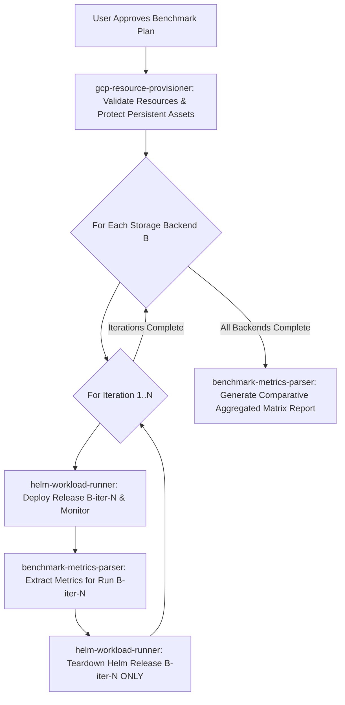

# ML Benchmark Orchestrator Skill (`ml-benchmark-orchestrator`)

This is the master orchestration skill for ML storage benchmarks on Google Cloud Platform and GKE. It references persistent baseline benchmarks and GCP storage knowledge located in [references/gcp_ml_storage_reference.md](references/gcp_ml_storage_reference.md).

---

## ⛔ CRITICAL RULE 1: INTERACTIVE ALIGNMENT FIRST

**NEVER start executing shell commands, creating resources, or deploying workloads immediately after receiving a vague or initial user request.**

Your **VERY FIRST ACTION** must be to conduct an interactive requirement alignment interview with the user. Use the `ask_question` tool or structured interactive prompts to confirm every key aspect of the benchmark run.

---

## 🔒 CRITICAL RULE 2: STRICT PERSISTENT RESOURCE PROTECTION

**NEVER delete, modify, or tear down user-supplied persistent resources.**

- **PERSISTENT ASSETS (DO NOT DELETE)**: Existing GKE clusters, existing Managed Lustre instances/PVCs, and existing GCS buckets supplied by the user.
- **EPHEMERAL BENCHMARK ASSETS (CLEAN UP AFTER RUN)**: Helm workload releases (`helm uninstall <RELEASE_NAME>`) created for the benchmark run.

---

## 📚 KNOWLEDGE BASE REFERENCE

Before conducting the interview or generating recommendations, read [references/gcp_ml_storage_reference.md](references/gcp_ml_storage_reference.md) for empirical throughput baselines (Managed Lustre ~953 MB/s vs GCSFuse ~611 MB/s vs `gcsfs` ~192 MB/s), checkpoint size formulas, and training stall estimations.

---

## 📋 Interactive Interview Questionnaire

Ask the user to clarify or confirm the following choices:

1. **Benchmark Workload & Model**:
   - PyTorch DDP (`hf-pytorch-lightning-cpu` simulating Llama 3.1 8B)
   - TensorStore (`tensorstore-gcsfuse` multi-dimensional array I/O)

2. **Storage Backends to Evaluate**:
   - Select one or multiple backends to compare sequentially:
     - `lustre`: Google Cloud Managed Lustre
     - `gcsfuse`: GCSFuse Streaming Writes
     - `gcsfs`: Direct GCS REST API
     - `all`: Compare all 3 storage backends sequentially

3. **Repeat Iterations**:
   - Number of repeat runs per storage backend (e.g., 1, 3, or 5 iterations) to compute mean, min, max, and standard deviation.

4. **Resource Provisioning Strategy**:
   - **Reuse Existing Resources**: Use currently connected GKE cluster, Lustre PVC, and GCS bucket.
   - **Provision New Resources**: Create a new GKE cluster, GCS bucket, or Managed Lustre instance from scratch.

5. **Dataset Path / Storage Location (MANDATORY CONFIRMATION)**:
   - Explicitly confirm the training dataset path URI or mount location:
     - For GCS/`gcsfs`: `gs://<BUCKET_NAME>/dataset` (or custom GCS Parquet path)
     - For GCSFuse: `/gcs/dataset` (or custom mounted GCS path)
     - For Managed Lustre: `/lustre/dataset` (or custom PVC dataset directory)

6. **Benchmark Execution Parameters**:
   - **GKE Node Pool & Machine Type** (e.g. `n4-standard-80`, `c4-standard-192`)
   - **Nodes & Ranks**: Number of compute nodes (default: 1) and ranks per node (default: 2)
   - **Training Steps & Checkpoint Interval**: Total training steps (e.g. 10 or 100) and how often to save checkpoints (e.g. every 5 or 25 steps)

---

## 🛑 MANDATORY STEP: FINAL PLAN REVIEW & USER APPROVAL

After collecting the user's responses from the Questionnaire and **BEFORE** invoking any sub-skills:

1. **Construct a Structured Benchmark Execution Matrix Plan**:
   Present a clear Markdown summary table detailing the test matrix, execution sequence, dataset path, total runs, and resource consumption:

   ### 📝 Comparative Benchmark Matrix Execution Plan Review
   | Parameter / Dimension | Target Configuration |
   | :--- | :--- |
   | **Workload & Model** | PyTorch DDP (Llama 3.1 8B) |
   | **Storage Backends to Compare** | `lustre` vs `gcsfuse` (2 Backends) |
   | **Dataset Path / Location** | `gs://chongliu-macrobench-dataset-f038a966` / `/lustre/dataset` |
   | **Repeat Iterations** | 3 Runs per Backend (**Total: 6 Benchmark Executions**) |
   | **Target GKE Cluster** | `chongliu-gke-persistent` (Zone: `us-central1-b`) [PERSISTENT - PROTECTED] |
   | **Node Pool & Nodes** | `n4-standard-80` (1 Node, 2 Ranks per Node) |
   | **Storage PVC / Bucket** | `lustre-checkpoint-pvc` / `chongliu-macrobench-dataset-f038a966` [PERSISTENT - PROTECTED] |
   | **Training Steps / Interval** | 10 Steps (Checkpoint every 5 steps) |

   ### 💰 Cloud Resource Consumption & Quota Budget Summary
   | Resource Type | Allocated Quantity & Spec | Quota & Cost Impact |
   | :--- | :--- | :--- |
   | **Compute Nodes** | 1 Node (`n4-standard-80`) | Reuses existing cluster (0 new nodes) |
   | **Accelerator Quota** | None (CPU Simulation Mode) | 0 GPU quota consumed |
   | **Storage Allocation**| Managed Lustre PVC / GCS Bucket | Reuses existing bucket & PVC |
   | **Estimated PoC Runtime** | ~5 - 8 Minutes total | Minimal compute cost / zero quota risk |

2. **Explicit User Approval Prompt**:
   Ask the user explicitly:
   > *"Please review the benchmark execution plan above. Do you approve proceeding with this run? (Proceed / Modify Plan)"*

3. **Strict Gatekeeping**:
   - **DO NOT** invoke `gcp-resource-provisioner` or `helm-workload-runner` until the user explicitly confirms with "Proceed", "Yes", or approves the plan.

---

## 🔀 Sub-Skill Delegation & Matrix Execution Loop

Once the user approves the execution plan:

1. **Phase 1: Environment & Resource Readiness**
   - Delegate to `gcp-resource-provisioner` once to verify cluster, PVC, bucket, and dataset path.

2. **Phase 2: Matrix Loop Execution**
   - For each target backend $B \in \{\text{Lustre}, \text{GCSFuse}, \text{gcsfs}\}$:
     - For iteration $i = 1 \dots N$:
       1. Delegate to `helm-workload-runner` to install release `pytorch-$B-iter-$i` with confirmed `${DATASET_PATH}`.
       2. Monitor execution milestones in background; notify user when run $i/N$ starts/finishes.
       3. Delegate to `benchmark-metrics-parser` to collect raw metrics for run $i$.
       4. Delegate to `helm-workload-runner` to uninstall release `pytorch-$B-iter-$i` (JobSet/Pod workload only).

3. **Phase 3: Comparative Aggregation Report**
   - Delegate to `benchmark-metrics-parser` to aggregate all iteration results (calculate Mean, Min, Max, Standard Deviation, and Speedup factor vs baseline).
