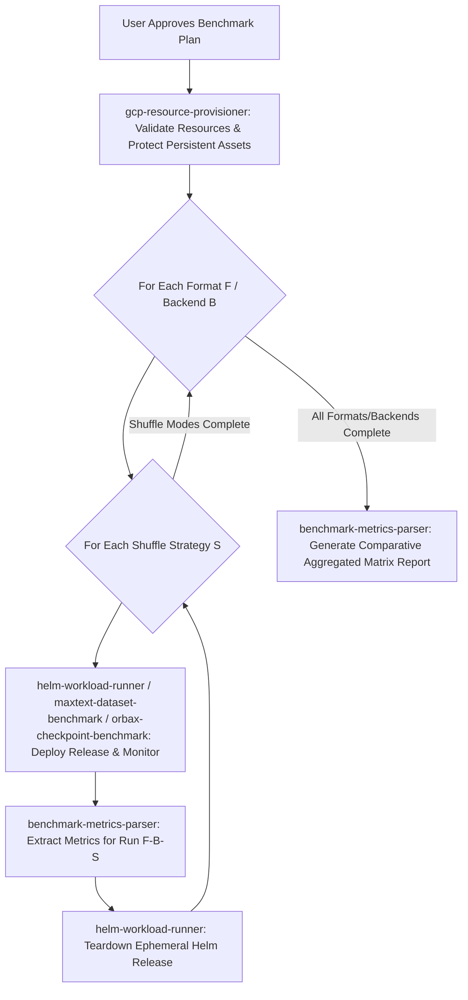

# ML Benchmark Orchestrator Skill (`ml-benchmark-orchestrator`)

This is the master orchestration skill for all ML storage, data loader, and model training benchmarks across `gcloud-ml-benchmarks`. It references persistent baseline benchmarks and GCP storage domain knowledge located in [references/gcp_ml_storage_reference.md](references/gcp_ml_storage_reference.md).

---

## ⛔ CRITICAL RULE 1: INTERACTIVE ALIGNMENT & PLAN CONFIRMATION FIRST (INITIAL & INCREMENTAL)

**NEVER start executing shell commands, creating resources, or deploying workloads immediately after receiving ANY benchmark or demo request (initial or incremental).**

1. **INTERACTIVE ALIGNMENT FIRST**: Always conduct interactive questionnaire alignment to confirm target dataset path, format, shuffle strategies, and access modes.
2. **NO-COMMAND FIRST TURN**: Your **VERY FIRST ACTION** for any benchmark request—including follow-up or supplemental requests (e.g. "补充DirectGCS", "再测一下不用manifest", "测试不同shuffle策略")—MUST be to present the structured Execution Plan Review table and/or conduct alignment.
3. **STRICT HARD-STOP UNTIL USER CONFIRMATION**: The Agent MUST pause and wait for explicit user confirmation (e.g. "Proceed" / "确认") before executing any `helm install`, `kubectl apply`, or benchmark workload commands.
4. **NEVER TREAT USER PROMPTS AS IMMEDIATE RUN TICKETS**: Even if the user's prompt is imperative, never execute commands in that same turn without an explicitly confirmed plan table.

---

## 🔒 CRITICAL RULE 2: STRICT PERSISTENT RESOURCE & DATASET PROTECTION

> [!CAUTION]
> **ABSOLUTE IMMUTABILITY RULE**: User-supplied or pre-existing GCS buckets AND user-supplied or pre-existing datasets MUST NEVER BE DELETED under any circumstances!
> - ⛔ **PERSISTENT BUCKETS (NEVER DELETE)**: Any bucket that existed before the benchmark or was provided by the user.
> - ⛔ **PERSISTENT DATASETS (NEVER DELETE)**: Any dataset or folder provided by the user or existing prior to the run.
> - ✅ **ONLY AGENT-CREATED EPHEMERAL ASSETS**: Only ad-hoc buckets created by the agent *during* the run and ephemeral Helm workload releases (`helm uninstall <RELEASE>`) may be cleaned up.

---

## ⏳ CRITICAL RULE 3: COMPLETE WORKLOAD MONITORING (DO NOT PREMATURELY TEARDOWN)

**NEVER uninstall or terminate benchmark releases while pods are still in `Running` or `ContainerCreating` status.**

- Always poll `kubectl get pods` until **ALL** workload pods in the active benchmark matrix have reached `Completed` status (or a strict maximum timeout is exceeded).
- Only parse logs and teardown ephemeral Helm releases AFTER 100% of workload pods have finished execution.

---

## 🛑 CRITICAL RULE 4: STRICT PLAN ADHERENCE & MANDATORY USER RE-APPROVAL FOR PLAN CHANGES

**NEVER unilaterally modify or deviate from an approved execution plan during execution.**

### 4.1 General Plan Change Protocol
If any error, resource constraint, quota limitation (e.g. inability to create a specific GCS bucket or node pool), or unexpected system behavior occurs during execution that prevents running according to the exact parameters in the approved execution plan:
1. **IMMEDIATELY PAUSE EXECUTION**: Do NOT attempt silent fallback or unapproved substitution of resources (such as silently switching bucket names or access modes).
2. **INFORM THE USER TRANSPARENTLY**: Explain the exact error/obstacle encountered and the technical reason why the original plan step failed.
3. **PRESENT PROPOSED PLAN AMENDMENT**: Clearly outline the proposed alternative.
4. **REQUIRE EXPLICIT USER RE-APPROVAL**: Wait for explicit user review and approval of the amended plan before resuming execution.

### 4.2 ⛔ ABSOLUTE PROHIBITION ON SILENT DATASET SUBSTITUTION
- **NO DATASET PIVOTING**: If the approved plan specifies generating and testing a synthetic dataset (or using a specific target dataset), the agent MUST NEVER silently substitute it with a pre-existing dataset found inside a target bucket (or vice-versa), even if dataset upload or generation encounters errors.
- **FAIL-FAST AND FIX**: If dataset generation or upload fails (e.g. due to GCS RAPID bucket API headers or resumable upload restrictions), the agent MUST fix the upload tool or pause for user review—NEVER pivot to an unapproved dataset source.

### 4.3 ⚖️ MANDATORY DATASET PARITY FOR COMPARATIVE BENCHMARKS
- In any comparative benchmark (e.g., Regional Standard vs. Rapid Zonal Bucket, or GCSFuse vs. Direct GCS connection), **all backends MUST be evaluated against identical dataset parameters**:
  - Exact same total size (GB / MB)
  - Exact same number of files / shards
  - Exact same schema and column fields (`input_ids`, `label`, etc.)
  - Exact same per-row payload bytes / sequence length
- Comparing different dataset sizes (e.g. 2 GB vs 420 GB) or different schemas across backends invalidates the benchmark and is strictly prohibited.

### 4.4 ⛔ ABSOLUTE PROHIBITION ON SILENT BUCKET OR RESOURCE SUBSTITUTION
- **NO SILENT BUCKET SUBSTITUTION**: The agent MUST NEVER substitute a planned bucket name with an unapproved fallback bucket name returned by a CLI tool.
- **MANDATORY RESOURCE MATCH VERIFICATION**: After running provisioning commands (such as `bucket_manager.py`), the agent MUST verify that the output resource name exactly matches the approved execution plan. If there is any discrepancy or error, the agent MUST immediately pause, inform the user, present candidate alternatives, and obtain explicit user re-approval.

---

## 🛠️ CRITICAL RULE 5: FORMAL REPOSITORY CLI TOOLS ONLY (NO ON-THE-FLY INLINE CODE GENERATION OR ADHOC COMMANDS)

**NEVER generate and execute ad-hoc inline Python snippets (e.g. `python3 -c "..."`) or multi-step adhoc bash commands for environment inspection, infrastructure management, or dataset verification.**

1. **MINIMIZE ON-THE-FLY CODE & ADHOC COMMANDS**: All cluster pre-flight inspection, node spec extraction, VPC MTU detection, GCSFuse CSI version checks, bucket provisioning, dataset inspection, and prefix cleanup MUST be executed via formal Python CLI tools in `tools/` committed to the repository.
2. **CALL COMMITTED REPO TOOLS**:
   - Cluster Pre-flight Diagnostics: `python3 tools/infrastructure/cluster_manager.py --format=table`
   - Bucket Provisioning & Cleanup: `python3 tools/infrastructure/bucket_manager.py --action=describe --bucket-name=gs://my-bucket`
   - Dataset Inspection & Shard Overview: `python3 tools/infrastructure/bucket_manager.py --action=inspect-dataset --dataset-uri=gs://bucket/path`
   - Synthetic Dataset Generation: `python3 tools/datasets/generator.py`
   - Parquet to ArrayRecord Preprocessing: `python3 tools/datasets/converters/parquet_to_arrayrecord.py`

---

## 🛑 CRITICAL RULE 6: ABSOLUTE NO-FREESTYLE & FAIL-FAST PROTOCOL

> [!CAUTION]
> **STRICT AGENT EXECUTION BOUNDARY**: The AI Agent MUST NOT freestyle, improvise, or generate ad-hoc Python snippets (`python3 -c "..."`) when encountering errors, API restrictions, or SDK exceptions.
> 1. **STRICT TOOL BOUNDARY**: Only pre-committed repository tools in `tools/` and standard Helm/kubectl commands are permitted. Writing inline python commands (`python3 -c`) or ad-hoc debugging scripts is strictly prohibited under any circumstances.
> 2. **FAIL-FAST AND PAUSE ON ERROR**: If any script, committed repo tool, or Helm deployment fails or returns an error (e.g. 400 Bad Request, quota error, SDK exception):
>    - ⛔ **DO NOT** attempt auto-debugging via `python3 -c "..."`.
>    - ⛔ **DO NOT** modify SDK internals or write ad-hoc workaround scripts on the fly.
>    - ✅ **IMMEDIATELY PAUSE EXECUTION**, report the exact stderr/Traceback transparently to the user, propose a formal plan amendment or tool fix, and wait for explicit user approval before taking any further action.

---

## 🚫 CRITICAL RULE 7: STRICT PROHIBITION ON AUTONOMOUS BUCKET SCANNING (USER-PROVIDED / USER-DIRECTED ONLY)

> [!CAUTION]
> **NO PROACTIVE BUCKET SCANNING OR DISCOVERY**:
> 1. **USER-PROVIDED OR USER-DIRECTED BUCKETS ONLY**: The Agent MUST only use target GCS bucket paths explicitly provided by the user (e.g. `gs://<user-bucket>/...`), or create a new bucket strictly upon the user's explicit command/instruction.
> 2. **NEVER SCAN/LIST PROJECT BUCKETS AUTONOMOUSLY**: Strict prohibition against running `gcloud storage ls`, `python3 tools/infrastructure/bucket_manager.py --action=list`, `resolve-existing`, or GCS listing APIs without explicit user instruction.
> 3. **NO BACKGROUND BUCKET ENUMERATION**: The agent must NEVER proactively discover, scan, or query existing buckets in the background. In the questionnaire and plan review table, always ask the user for the dataset path or leave it as `[Pending User Provision / Confirmation]`.

---

## 🛠️ ENVIRONMENT PRE-FLIGHT DIAGNOSTICS & AUTOMATED SETUP

Before launching benchmark workloads or running dataset tools, the Orchestrator MUST execute environment diagnostics:

### 1. Environment & Dependency Pre-flight Check:
Execute `python3 tools/infrastructure/env_checker.py --format=table` to automatically verify:
- **System CLI Tools**: `gcloud`, `kubectl`, `helm`, `python3`, `git`.
- **Python Package Dependencies**: `google-cloud-storage`, `pyyaml`, `pyarrow`, `pandas`, `requests`.
- **GCP & K8s Authentication**: Active `gcloud` account, active GCP project, and reachable Kubernetes context.
- **Interactive Remediation Plan Review**: If any required CLI tool, Python package, or authentication check fails pre-flight verification, DO NOT fix it directly. Present a structured Markdown Remediation Plan table outlining the missing components and proposed remediation commands, and wait for explicit user review and confirmation before proceeding.

### 2. Unified Cluster Pre-flight Inspection:
Execute `python3 tools/infrastructure/cluster_manager.py --format=json` to automatically inspect:
- **GKE Kubelet & Master Version**: Version of current active cluster context.
- **Compute Node Hardware Specs**: Machine type (e.g. `n4-standard-80`), vCPU capacity, RAM (GiB), OS distribution, kernel, and container runtime.
- **GCSFuse CSI Driver Version**: Detection of CSI driver addon and specific version tag (`v1.22.21-gke.1`).
- **VPC Network MTU Configuration**: Network interface MTU (`MTU 8896 (Jumbo Frames)` vs `MTU 1460 (Standard)`).
- **JobSet Controller CRD**: Verification of `jobsets.jobset.x-k8s.io` CRD.

### 3. User-Provided GCS & Lustre Dataset Overview Inspection:
- **GCS Dataset Inspection**: When the user explicitly provides a target dataset path `gs://<BUCKET>/<PATH>`, execute `python3 tools/infrastructure/bucket_manager.py --action=inspect-dataset --project-id=${PROJECT_ID} --dataset-uri=gs://<BUCKET>/<PATH>` to inspect target dataset dimensions (total size, total shards, average file size, detected file format). NEVER inspect or scan buckets not provided by the user.
- **Lustre Dataset Discovery & Staging Protocol**:
  - **Inspection**: When benchmarking Managed Lustre, inspect the Lustre mount path (`/lustre`) via standard PVC inspection to verify if the dataset shards exist on Lustre.
  - **Explicit Staging Notice (When Not Found)**: If the target dataset cannot be located on Lustre, the agent MUST explicitly inform the user before copying/syncing from GCS to Lustre, detail the source/destination paths, transfer method, and estimated transfer size/time, and obtain explicit user confirmation.
---

## 👥 CRITICAL RULE 8: MANDATORY DATALOADER WORKER COUNT VISIBILITY

> [!IMPORTANT]
> **ALWAYS SHOW NUMBER OF WORKERS FOR DATASET LOADING**:
> Whenever planning, reviewing, or reporting on dataset loading or model training benchmarks, the Agent MUST explicitly specify and display the DataLoader concurrency settings:
> 1. **Worker Process Count (`num_workers`)**: Explicitly report the number of worker processes per rank (e.g. `num_workers=4`).
> 2. **Prefetch Factor (`prefetch_factor`)**: Specify batch prefetching per worker (e.g. `prefetch_factor=2`).
> 3. **Visibility Requirements**: Must appear in:
>    - The Interactive Questionnaire Alignment.
>    - The Execution Plan Review table.
>    - The Input Dataset Overview table.
>    - The Final Comparative Summary table.

---

## 🔌 CRITICAL RULE 9: MANDATORY STORAGE ACCESS MODE ALIGNMENT (GCSFUSE VS DIRECT GCS VS LUSTRE)

> [!IMPORTANT]
> **ALWAYS EXPLICITLY ASK & ALIGN ACCESS MODE BEFORE RUNNING BENCHMARKS**:
> Whenever benchmarking dataset loading, dataloaders, or storage backends, the Agent MUST explicitly clarify the Storage Access Mode in the interactive questionnaire:
> 1. **GCSFuse CSI Driver Mount (`accessMode=gcsfuse`)**: POSIX filesystem mount with kernel VFS / file cache options.
> 2. **Direct GCS Client (`accessMode=native_gcs` / `gcsfs`)**: Native Python/C++ HTTP/gRPC Cloud Storage client.
> 3. **Managed Lustre (`accessMode=lustre`)**: High-performance parallel filesystem mount.
> 4. **Side-by-Side Comparison Matrix**: Running both GCSFuse and Direct GCS (and Lustre) to compare throughput, latency, and TTFB.
> 5. **Visibility Requirements**: The active Access Mode and its mount/client configurations MUST appear in the interactive questionnaire, the Execution Plan Review table, and the final summary table.

---

## ⚡ CRITICAL RULE 10: COLD-START BUFFER PRIMING & METADATA STORM GOVERNANCE

> [!IMPORTANT]
> **PREVENT METADATA LISTING STORMS & PROFILE STEP-1 COLD START**:
> Whenever benchmarking large-scale dataset loading across distributed training nodes:
> 1. **Manifest-First Shard Discovery**: Always prefer reading a single `manifest.json` (listing all shard filenames) rather than issuing runtime `os.walk()` or `glob.glob()` calls across thousands of remote files to prevent GCS List API throttling (HTTP 429/503).
> 2. **Cold-Start Buffer Priming Visibility**: Explicitly report Time to First Batch (TTFB) and the initial shuffle buffer priming scale (e.g. 20,000 samples) before Step 1 compute triggers.
> 3. **CPU Tokenizer vs Pre-Tokenized Profiling**: Clearly separate storage I/O latency from CPU tokenization compute overhead when evaluating raw text (Parquet) vs pre-tokenized binary (ArrayRecord).

---

## 🛑 CRITICAL RULE 11: NON-INTRUSIVE BENCHMARK LOGGING & ZERO-LOCK I/O MEASUREMENT (NO TICKER STAT POLLING)

> [!CAUTION]
> **PREVENT METADATA LOCK CONTENTION & STREAMING WRITE INTERRUPTIONS**:
> During multi-gigabyte sequential checkpoint writes (hundreds of MB/s to GB/s):
> 1. **No Concurrent Ticker File Stat Polling**: Workload logging MUST NOT run active background threads that repeatedly poll (`os.stat`, `st_blocks`, or GCS REST metadata APIs) the target checkpoint file while it is being written. Doing so triggers Linux VFS / FUSE and parallel filesystem (Lustre) **Metadata Lock Contention**, interrupts sequential write buffers, and causes a 15%~36% throughput degradation.
> 2. **Direct Zero-Lock I/O Timestamping**: Always capture upload and save durations directly around the core I/O write block (`io_start = time.perf_counter() ... torch.save(...) ... io_duration = time.perf_counter() - io_start`), ensuring clean, lock-free, zero-jitter physical throughput measurement.

---

## 📊 CRITICAL RULE 12: DUAL-METRIC CHECKPOINT MEASUREMENT PROTOCOL (PURE STORAGE I/O VS CPU SERIALIZATION)

> [!IMPORTANT]
> **SEPARATE CPU TENSOR SERIALIZATION FROM PURE STORAGE NETWORK I/O**:
> In distributed checkpoint evaluations (particularly comparing FSDP sharded checkpointing vs DDP single writer on CPU or multi-rank setups):
> 1. **Dual Metric Reporting**: Benchmark logs, progress output, and Markdown report summaries MUST report both:
>    - **Pure Storage I/O Throughput & Duration (Physical Speed)**: The true physical data transfer rate to the storage backend (e.g. Lustre 2.85 GB/s, GCSFuse 1.57 GB/s, GCSFS 1.44 GB/s).
>    - **Total End-to-End Save Duration (Framework Time)**: The overall checkpoint hook duration including Python dictionary unpacking, `FlatParamHandle` restructuring, optimizer state remapping, and Gloo/NCCL socket barriers.
> 2. **Prevent Metric Distortion**: Never attribute CPU-bound un-sharding or serialization latency to storage backend network bottlenecks. Clearly distinguish single-stream TCP limits (DDP single writer) from linear multi-stream bandwidth scaling (FSDP $N$-rank concurrent writers).

---

## 📚 KNOWLEDGE BASE REFERENCE

Before conducting the interview or generating recommendations, read [references/gcp_ml_storage_reference.md](references/gcp_ml_storage_reference.md) for empirical throughput baselines, checkpoint size formulas, and training stall estimations.
- **Empirical 44.85 GB Llama 3.1 8B Checkpoint Baselines**:
  - **Managed Lustre**: **722.34 MB/s (5.64 Gbps)** raw write speed, **68.54s** mean save duration, **669.63 MB/s** aggregated throughput.
  - **GCSFuse CSI (Streaming Writes)**: **447.31 MB/s (3.49 Gbps)** raw write speed, **108.34s** mean save duration, **426.43 MB/s** aggregated throughput.
  - **Direct GCS (`gcsfs` / `ExtendedGcsFileSystem`)**: **298.48 MB/s (2.33 Gbps)** raw write speed, **159.25s** mean save duration, **288.89 MB/s** aggregated throughput.
- **Empirical Dataset Loading & Multi-Worker Initialization (`num_workers=4`, 1,650 Parquet shards, 420.10 GB)**:
  - **Manifest Prep Time**: GCSFuse CSI (**0.8983s**) fastest via kernel VFS caching > Lustre (**2.2408s**) > Direct GCS (**4.3058s**).
  - **Worker Spawn & Prefetch Time**: GCSFuse (**20.71s**) ≈ Lustre (**20.88s**) ≈ Direct GCS (**21.52s**).
  - **Step Ingestion Throughput**: Lustre (**370.97 samples/s** avg, 528.92 peak) > GCSFuse (**354.19 samples/s** avg, 528.75 peak) > Direct GCS (**340.53 samples/s** avg, 517.27 peak).
- **PyTorch Multi-Worker POSIX Decoupling**: PyTorch multi-process `DataLoader(num_workers > 0)` uses `fork()`, which fatally conflicts with in-process multi-threaded C-core gRPC/HTTP2 networking in naive `gcsfs` (resulting in `fork_posix.cc: Other threads are currently calling into gRPC, skipping fork() handlers`, `Check failed: next_worker->state == KICKED`, and worker segmentation faults). In contrast, **GCSFuse** and **Managed Lustre** decouple I/O into external POSIX filesystem daemons or kernel drivers, providing full multi-worker stability and high streaming bandwidth (~722 MB/s Lustre, ~447 MB/s GCSFuse).
- **Single-PVC Lustre Mount Convention**: When benchmarking Lustre where dataset files and checkpoints share the same underlying Lustre filesystem, setting `--set lustre.mountPathCheckpoint="/lustre"` provides unified root-level access to both `/lustre` (for dataset reads) and `/lustre/checkpoints` (for checkpoint writes) without requiring dual PVC claims.
- **Empirical 44.87 GiB PyTorch Checkpoint Restore Baselines & Cache Architectures**:
  - **GCSFuse CSI Driver (Pure Cold Read)**: **30.91s** restore duration, **1,486.47 MB/s** per-rank rate, **2,972.94 MB/s (~2.97 GB/s)** aggregate cluster bandwidth (Kernel VFS file caching satisfies thousands of fine-grained `_pickle` tensor header `seek()` calls instantly in RAM; scaling to 4 ranks reaches **5.59 GB/s**).
  - **Managed Lustre (Pure Cold Read & Write-then-Immediate-Read)**: **31.41s ~ 32.86s** restore duration, **1,398.26 MB/s** per-rank rate, **2,796.52 MB/s (~2.80 GB/s)** aggregate bandwidth (Zero REST API overhead, direct parallel OST chunk striping over MTU 8896; native write-immediately-read matches settled cold read with zero lock contention).
  - **Direct GCS (`gcsfs` + BlockCache 64MB)**: **135.64s (~2.26 min)** restore duration, **338.74 MB/s** per-rank rate, **677.48 MB/s** aggregate bandwidth (**28x acceleration** over unbuffered streams by absorbing tensor header seeks in 64MB Python RAM blocks).
  - **Direct GCS (`gcsfs` Unbuffered Default)**: **> 900.00s (> 15 min)** due to the **Seek Storm** (Python `torch.load` unpickling triggers tens of thousands of unbuffered HTTP Range GET round-trips over user-space sockets).
  - **Mandatory Production Guardrails**:
    1. **Primary Production Standard**: Always use **GCSFuse CSI Driver** (with `file-cache:max-size-mb:-1`) or **Managed Lustre** for PyTorch model checkpoint restoration.
    2. **Fallback for Pure Python `fsspec`**: If CSI mounts are unavailable, always explicitly configure `cache_type="blockcache", block_size=67108864` (64MB) in `fsspec.open` to avoid 15+ minute seek storm freezes.
    3. **Cold Benchmark Guarantee Protocol**: Always execute `sync; echo 3 > /proc/sys/vm/drop_caches` via a privileged dropper pod before starting cold-read benchmark runs to eliminate OS Page Cache interference.

---

## 📋 Interactive Interview Questionnaire (Universal for All Workloads)

Ask the user to clarify or confirm choices across the following dimensions:

### 1. Benchmark Workload & Model:
- **MaxText Dataset Loader** (`maxtext-dataset-loader` supporting `loaderMode=storage_bench` for storage micro-benchmarks & range reads, and `loaderMode=in_tree_loader` integrating native `standalone_dataloader.py` for full Grain/JAX data pipelines)
- **PyTorch Multi-Format ML Dataset Loader** (`multi-format-dataset-loader` testing HF `datasets`, `webdataset`, `tensorstore`, `torch.DataLoader`)
- **PyTorch DDP Checkpointing** (`hf-pytorch-lightning-cpu` simulating Llama 3.1 8B)
- **TensorStore Multi-dimensional I/O** (`tensorstore-gcsfuse`)

### 2. Dataset Location & Formats (For MaxText & Dataset Loaders):
> [!IMPORTANT]
> **MANDATORY (USER-PROVIDED BUCKET ONLY)**: You MUST explicitly request the GCS Dataset Path (e.g. `gs://my-bucket/dataset`) directly from the user or offer creating a new synthetic dataset bucket upon explicit user instruction. **DO NOT auto-discover or scan existing buckets in the project.**
- **GCS Dataset Path**: User-provided GCS Bucket and prefix path containing ArrayRecord or Parquet files.
- **Input Format**: `Parquet`, `ArrayRecord`, `WebDataset TAR`, `Zarr / TensorStore`, `PyTorch .pt`, `JSONL`
- **Target Comparison Format**: Test direct format vs pre-tokenized `ArrayRecord`
- **Optional Preprocessing / Conversion**: Ask if user wants to run `parquet_to_arrayrecord.py` to pre-tokenize raw Parquet shards into ArrayRecord before training.

### 3. Shuffle Strategies (For MaxText / Data Loaders):
> [!IMPORTANT]
> **MANDATORY**: You MUST explicitly confirm the Shuffle Strategy with the user or state the default (`none`) in the Plan Review table before execution.
- `none`: Baseline natural order streaming (Default for pure physical I/O bandwidth tests).
- `two_stage` (Production Standard for Streaming & Parquet): Shard-level permutation + multi-worker concurrent streaming into sliding in-memory buffer. Guarantees 0-duplication and 0-omission with high sequential I/O throughput.
- `global` (Native to Index-based Formats like ArrayRecord + Grain): True random point-read indexing across all records.
  - ⚠️ **Architectural Constraint for Parquet**: Columnar Parquet cannot perform online True Global Shuffle due to Row-Group compression (arbitrary row seeks incur 5,000x~50,000x CPU decompression & I/O amplification). In Parquet streaming, `global` falls back to 2-stage approximation (full shard list permutation + large buffer). For true global shuffle without offline ETL, **ArrayRecord + Grain** is mandatory.
- `all`: Comparative benchmark across all shuffle modes.

### 4. Storage Backends / Access Modes to Evaluate:
> [!IMPORTANT]
> **MANDATORY**: You MUST explicitly clarify with the user whether to benchmark via GCSFuse sidecar mount (`gcsfuse`), direct GCS client connection (`native_gcs` / `gcsfs`), Cloud Managed Lustre (`lustre`), or run a comparative matrix across all access modes (`all`).
- `native_gcs` / `gcsfs`: Direct GCS REST/gRPC Range Requests
- `gcsfuse`: GCSFuse Sidecar Mount with range-read caching
- `lustre`: Google Cloud Managed Lustre
- `all`: Compare all storage backends sequentially

### 5. Repeat Iterations & Scale:
- Number of repeat runs per configuration (e.g. 1, 3, or 5 iterations)
- `batch_size` (default: 64) and `max_batches` (default: 100)

### 6. Target Cluster & Resource Strategy:
- **Reuse Existing Persistent Cluster**: If the user has an available GKE cluster, deploy Helm releases -> run benchmark -> clean up Pods & Helm releases when done. **NEVER delete or tear down pre-existing persistent clusters.**
- **Provision Temporary Ephemeral Cluster**: If the user has no available GKE cluster, propose creating a temporary test cluster (`gcloud container clusters create-auto` via `gcp-resource-provisioner`). Deploy Helm releases -> run benchmark -> **Destroy and tear down the temporary GKE cluster immediately after the benchmark run completes!**

> [!WARNING]
> **STRICT GKE ONLY**: ALL benchmark workloads MUST run on authentic GCP GKE clusters (either user's persistent cluster or a temporary ephemeral test cluster). DO NOT suggest or attempt running local K8s (e.g. Kind, Minikube) or non-K8s local Python execution, as they cannot measure authentic GCP GCS / Rapid Bucket egress performance or GCSFuse CSI Driver capabilities.

---

## 🛑 MANDATORY STEP: FINAL PLAN REVIEW & USER APPROVAL

After collecting the user's responses from the Questionnaire and **BEFORE** invoking any sub-skills or executing shell commands:

1. **Construct a Structured Benchmark Execution Plan**:
   Present a clear Markdown summary table detailing the test matrix, execution sequence, dataset path, total runs, and resource consumption.

   > [!CAUTION]
   > **MANDATORY SHUFFLE STRATEGY ROW**: You MUST ALWAYS include the dedicated `**Shuffle Strategies / Buffer**` row in the primary plan review table! Never omit or skip this row.

   ### 📝 Comparative Benchmark Matrix Execution Plan Review
   | Parameter / Dimension | Target Configuration |
   | :--- | :--- |
   | **Workload & Model** | MaxText Dataset Loader (`maxtext-dataset-loader`) or PyTorch Multi-Format Loader (`multi-format-dataset-loader`) |
   | **GCP Project ID** | `[Project ID]` (Auto-discovered from environment) |
   | **Target GKE Cluster & Version** | `[Cluster Name]` (GKE Version: `v1.35.x`, Zone: `[Zone]`) [PERSISTENT - PROTECTED] |
   | **Compute Node Specs** | `n4-standard-80` (80 vCPUs, 314.68 GiB RAM, `containerd://2.1.7`) |
   | **GCSFuse CSI Driver Version** | `v1.22.21-gke.1` (Image Tag: `gke-release/gcs-fuse-csi-driver`) |
   | **VPC Network MTU Setting** | `MTU 8896 (Jumbo Frames)` or `MTU 1460 (Standard)` |
   | **Input Dataset Path & Type** | `gs://<user-dataset-bucket>/...` (Storage Class: `STANDARD` / `RAPID`) |
   | **Dataset Format & Fields** | `Parquet` (Hugging Face Datasets / PyArrow) |
   | **Shuffle Strategies / Buffer** | **`none` (Default: sequential streaming, buffer=0)** or **`two_stage` / `buffer_size=10,000`** |
   | **DataLoader Workers & Prefetch** | `num_workers=4` per rank, `prefetch_factor=2` |
   | **Workload Parameters** | `batch_size=64`, `max_batches=100`, `epochs=1` |
   | **Storage Backends Under Test** | **Managed Lustre (`lustre`)** vs. **GCSFuse CSI (`gcsfuse`)** vs. **Direct GCS (`native_gcs` / `gcsfs`)** |

   ### 📦 Input Dataset Overview & Storage Discovery Status (MANDATORY BEFORE STARTING)
   | Dataset Dimension | GCS Storage Asset | Managed Lustre Asset |
   | :--- | :--- | :--- |
   | **Asset Identifier / Path** | `gs://<user-dataset-bucket>/...` | `/lustre` (PVC: `lustre-checkpoint-pvc`) |
   | **Total Dataset Size** | `420.10 GB` (430,182.56 MB) | `420.10 GB` (430,182.56 MB) |
   | **Total Shard Files** | `1,650 shards` | `1,650 shards` |
   | **Average File Size** | `~260.72 MB / file` | `~260.72 MB / file` |
   | **Dataset Format & Schema** | `Parquet` | `Parquet` |
   | **Active Shuffle Strategy** | **`none` (Sequential streaming)** | **`none` (Sequential streaming)** |
   | **Staging / Discovery Status** | Source Storage Asset | **Discovered Pre-Existing on Lustre (0 MB copy required, 100% parity)** |

   ### 💰 Cloud Resource Consumption Summary
   | Resource Type | Allocated Quantity & Spec | Quota & Cost Impact |
   | :--- | :--- | :--- |
   | **Compute Nodes** | Reuses existing GKE cluster nodes | 0 new nodes / 0 GPU quota |
   | **Storage Allocation**| Reuses existing GCS Bucket | Minimal ephemeral staging |
   | **Estimated Runtime** | ~6 - 10 Minutes total | Zero quota risk |

2. **Explicit User Approval Prompt**:
   Ask the user explicitly:
   > *"Please review the proposed execution plan above. Do you approve proceeding with this run? (Reply 'Proceed' / '确认' to begin execution)"*

3. **Strict Gatekeeping**:
   - **DO NOT** invoke sub-skills (`gcp-resource-provisioner`, `maxtext-dataset-benchmark`, `helm-workload-runner`) until the user explicitly approves the plan.

---

## 🔀 Sub-Skill Delegation & Matrix Execution Loop

Once the user approves the execution plan:

---

## 📊 Post-Benchmark Standardized Report Generation Protocol

When generating or updating benchmark results in `docs/**/results/*.md`:
1. **Invoke `benchmark-metrics-parser`**: Extract metrics from workload stdout, calculate multi-run statistical aggregates (median, standard deviation), and generate comparative Markdown summaries.
2. **Enforce 5-Stage Report Architecture**: All output reports MUST strictly follow the standard 5-stage structure (`1. Testbed Configuration & Workload Dimensions` ➔ `2. End-to-End Performance & Acceleration Results` ➔ `3. Physical Layout / Structural Breakdown (Optional)` ➔ `4. Technical Analysis, Resource Efficiency & ROI` ➔ `5. Related Documentation`).
3. **Strict Anonymization & English Tables**: NEVER leak private cluster names (`*-gke-persistent`) or private bucket names. All tables and metrics MUST be written in English.

---

## 📚 Specialized Workload Sub-Skills Registry

| Sub-Skill Name | Scope & Workload Focus | Skill Reference Link |
| :--- | :--- | :--- |
| **`maxtext-dataset-benchmark`** | MaxText Parquet vs ArrayRecord DataLoader streaming, GKE StorageClass Profiles (`gcsfusecsi-training`), two-stage shuffle | [`skills/maxtext-dataset-benchmark/SKILL.md`](../maxtext-dataset-benchmark/SKILL.md) |
| **`orbax-checkpoint-benchmark`** | Orbax/TensorStore FSDP topology adaptation, CPU streaming resharding, optimizer stripping, concurrent restore acceleration | [`skills/orbax-checkpoint-benchmark/SKILL.md`](../orbax-checkpoint-benchmark/SKILL.md) |
| **`gcp-resource-provisioner`** | Pre-flight diagnostics, cluster inspection, bucket lifecycle management, persistent asset protection | [`skills/gcp-resource-provisioner/SKILL.md`](../gcp-resource-provisioner/SKILL.md) |
| **`helm-workload-runner`** | Cloud-native JobSet deployment, dynamic values overrides, lifecycle monitoring until `Completed` | [`skills/helm-workload-runner/SKILL.md`](../helm-workload-runner/SKILL.md) |
| **`benchmark-metrics-parser`** | Container log extraction, multi-run statistical metrics aggregation, automated Markdown report generation | [`skills/benchmark-metrics-parser/SKILL.md`](../benchmark-metrics-parser/SKILL.md) |

