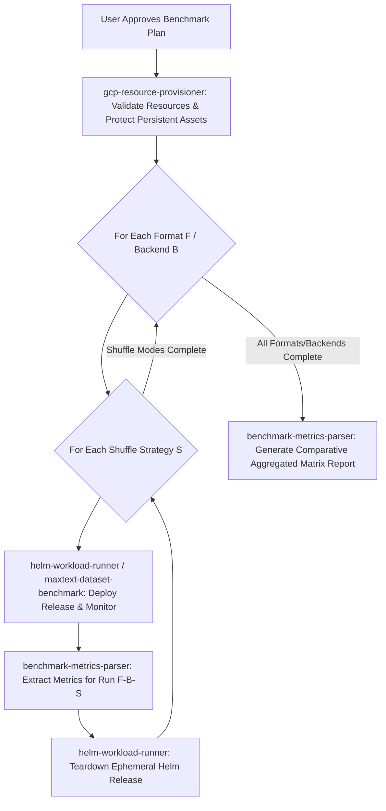

# ML Benchmark Orchestrator Skill (`ml-benchmark-orchestrator`)

This is the master orchestration skill for all ML storage, data loader, and model training benchmarks across `gcloud-ml-benchmarks`. It references persistent baseline benchmarks and GCP storage domain knowledge located in [references/gcp_ml_storage_reference.md](references/gcp_ml_storage_reference.md).

---

## ⛔ CRITICAL RULE 1: INTERACTIVE ALIGNMENT FIRST (UNIVERSAL DEMO PROTOCOL)

**NEVER start executing shell commands, creating resources, or deploying workloads immediately after receiving a request.**

Your **VERY FIRST ACTION** for any demo or benchmark request must be to conduct an interactive alignment interview with the user. Use structured prompts or `ask_question` to confirm every key aspect of the workload and target options.

---

## 🔒 CRITICAL RULE 2: STRICT PERSISTENT RESOURCE PROTECTION

**NEVER delete, modify, or tear down user-supplied persistent resources.**

- **PERSISTENT ASSETS (DO NOT DELETE)**: Existing GKE clusters, existing Managed Lustre instances/PVCs, and existing GCS buckets supplied by the user.
- **EPHEMERAL BENCHMARK ASSETS (CLEAN UP AFTER RUN)**: Helm workload releases (`helm uninstall <RELEASE_NAME>`) created for the benchmark run.

---

## 📚 KNOWLEDGE BASE REFERENCE

Before conducting the interview or generating recommendations, read [references/gcp_ml_storage_reference.md](references/gcp_ml_storage_reference.md) for empirical throughput baselines (Managed Lustre ~953 MB/s vs GCSFuse ~611 MB/s vs `gcsfs` ~192 MB/s), checkpoint size formulas, and training stall estimations.

---

## 📋 Interactive Interview Questionnaire (Universal for All Workloads)

Ask the user to clarify or confirm choices across the following dimensions:

### 1. Benchmark Workload & Model:
- **MaxText Parquet / ArrayRecord Dataset Loader** (`maxtext-parquet-loader` simulating MaxText JAX LLM training input pipelines)
- **Multi-Format ML Dataset Loader** (`multi-format-dataset-loader` testing HF `datasets`, `webdataset`, `tensorstore`, `torch.DataLoader`)
- **PyTorch DDP Checkpointing** (`hf-pytorch-lightning-cpu` simulating Llama 3.1 8B)
- **TensorStore Multi-dimensional I/O** (`tensorstore-gcsfuse`)

### 2. Dataset Formats & Preprocessing (For MaxText & Dataset Loaders):
- **Input Format**: `Parquet`, `ArrayRecord`, `WebDataset TAR`, `Zarr / TensorStore`, `PyTorch .pt`, `JSONL`
- **Target Comparison Format**: Test direct format vs pre-tokenized `ArrayRecord`
- **Optional Preprocessing / Conversion**: Ask if user wants to run `parquet_to_arrayrecord.py` to pre-tokenize raw Parquet shards into ArrayRecord before training.

### 3. Shuffle Strategies (For MaxText / Data Loaders):
- `none`: Baseline natural order streaming
- `two_stage` (Recommended): Shard order shuffle + Batch buffer sliding window
- `global`: True random point-read indexing
- `all`: Comparative benchmark across all 3 shuffle modes

### 4. Storage Backends / Access Modes to Evaluate:
- `native_gcs` / `gcsfs`: Direct GCS REST/gRPC Range Requests
- `gcsfuse`: GCSFuse Sidecar Mount with range-read caching
- `lustre`: Google Cloud Managed Lustre
- `all`: Compare all storage backends sequentially

### 5. Repeat Iterations & Scale:
- Number of repeat runs per configuration (e.g. 1, 3, or 5 iterations)
- `batch_size` (default: 64) and `max_batches` (default: 100)

### 6. Target Cluster & Resource Strategy:
- **Reuse Existing Resources**: Connected GKE cluster, GCS bucket, and Lustre PVC.
- **Provision New Resources**: Create a new GKE cluster, GCS bucket, or Lustre instance.

---

## 🛑 MANDATORY STEP: FINAL PLAN REVIEW & USER APPROVAL

After collecting the user's responses from the Questionnaire and **BEFORE** invoking any sub-skills or executing shell commands:

1. **Construct a Structured Benchmark Execution Plan**:
   Present a clear Markdown summary table detailing the test matrix, execution sequence, dataset path, total runs, and resource consumption:

   ### 📝 Comparative Benchmark Matrix Execution Plan Review
   | Parameter / Dimension | Target Configuration |
   | :--- | :--- |
   | **Workload & Model** | MaxText Dataset Loader (`maxtext-parquet-loader`) |
   | **Input Dataset & Path** | `gs://chongliu-macrobench-dataset-965f0fed` (Parquet) |
   | **Target Test Formats** | `Parquet` & `ArrayRecord` (Side-by-Side Comparison) |
   | **Optional Preprocessing** | Run `parquet_to_arrayrecord.py` conversion first |
   | **Shuffle Strategies** | `two_stage`, `global` |
   | **Target GKE Cluster** | `chongliu-gke-persistent` (Zone: `us-central1-b`) [PERSISTENT - PROTECTED] |
   | **Workload Parameters** | `batch_size=64`, `max_batches=100` |

   ### 💰 Cloud Resource Consumption Summary
   | Resource Type | Allocated Quantity & Spec | Quota & Cost Impact |
   | :--- | :--- | :--- |
   | **Compute Nodes** | Reuses existing GKE cluster nodes | 0 new nodes / 0 GPU quota |
   | **Storage Allocation**| Reuses existing GCS Bucket | Minimal ephemeral staging |
   | **Estimated Runtime** | ~3 - 5 Minutes total | Zero quota risk |

2. **Explicit User Approval Prompt**:
   Ask the user explicitly:
   > *"Please review the proposed execution plan above. Do you approve proceeding with this run? (Reply 'Proceed' / '确认' to begin execution)"*

3. **Strict Gatekeeping**:
   - **DO NOT** invoke sub-skills (`gcp-resource-provisioner`, `maxtext-dataset-benchmark`, `helm-workload-runner`) until the user explicitly approves the plan.

---

## 🔀 Sub-Skill Delegation & Matrix Execution Loop

Once the user approves the execution plan:

