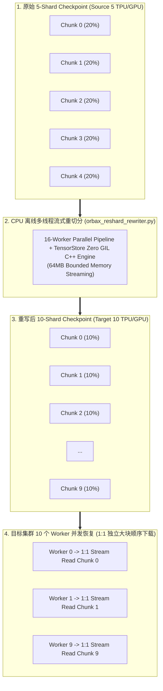

# Orbax Checkpoint Resharding & Restore Benchmark Sub-Skill (`orbax-checkpoint-benchmark`)

This is a specialized workload sub-skill for evaluating and benchmarking **Orbax and TensorStore checkpoint offline resharding and restore acceleration on GKE and Google Cloud Storage (GCS)**. It provides production engineering guidelines, CLI tools, Helm deployment templates, and empirical benchmark baselines for optimizing checkpoint I/O when restoring models across changing sharding topologies (e.g., transitioning from 100 TPU chips to 500 TPU chips, or changing FSDP cluster sizes).

*Note*: Master interactive questionnaires and Plan Approval Protocols are governed by [`ml-benchmark-orchestrator`](../ml-benchmark-orchestrator/SKILL.md).

---

## 💡 Production Problem: The Byte-Range Read Storm

When training large foundation models (e.g. LLaMA, Gemma, MaxText) using FSDP (Fully Sharded Data Parallel) or Tensor Parallelism:
1. **Source Topology Mismatch**: Checkpoints saved on $N$ chips (e.g. 5 shards or 100 TPU chips) store TensorStore arrays divided into $N$ chunk files along dimension 0.
2. **Byte-Range Storm on Cluster Upscaling**: When the model is later restored on $M$ chips (e.g. 10 workers or 500 TPU chips, where $M > N$), each worker requests an unaligned byte slice from the existing chunks.
3. **Severe Storage Amplification & I/O Bottlenecks**:
   - Every worker issues thousands of small HTTP/gRPC `Range` read requests against GCS objects.
   - Induces high Time-To-First-Byte (TTFB) connection latency, FUSE kernel reader queueing, and potential GCS 429 rate-limiting.
   - Significant CPU overhead on each worker to unpack and recombine slices in memory.
   - **Restore times degrade severely**, causing prolonged cluster stalls during critical training recoveries and serving rollouts.

---

## 🚀 Solution: Offline CPU Streaming Resharding

By running a pre-flight offline rewrite on low-cost CPU nodes (or during checkpoint export):
- Arrays are pre-chunked to match the target cluster topology ($M$ chunks for $M$ workers) or optimal storage chunk sizes (e.g., 64MB per chunk).
- Workers perform clean **1:1 sequential stream downloads** from GCS, completely eliminating Range-read amplification.
- Optimizer states can be stripped (`--strip-opt-state`) for inference serving checkpoints, reducing storage footprint by 66%.
- Precision can be safely downcast (`--cast-dtype bfloat16`) to cut I/O bandwidth in half.



---

## 📊 Empirical 100GB Cloud Benchmark Findings

Tested on GKE with `n4-standard-80` nodes (80 vCPU, 314 GiB RAM) mounted with **Google Cloud Storage RAPID Zonal Bucket** (DirectPath enabled, VPC MTU 8896):

- **Model Scale**: 16 Layers $\times$ 7 Weight Matrices = 112 TensorStore Arrays (Hidden Dim $16384 \times 16384$, **112.0 GB** total float32 volume).
- **Topology Transition**: 5 Source Shards $\to$ 10 Concurrent Restoring Workers.

| 评测评估维度 | 未重写 Baseline (5-shard -> 10 Workers) | 重写后 Optimized (10-shard -> 10 Workers) | 性能收益与加速比 |
| :--- | :--- | :--- | :--- |
| **112 GB 恢复中位耗时** | **33.35 秒** (33,354.5 ms) | **24.74 秒** (24,739.5 ms) | **1.35x 提速 (耗时降低 25.8%)** |
| **GCS 有效恢复吞吐** | **3,438.46 MB/s** (3.44 GB/s) | **4,635.83 MB/s** (4.64 GB/s) | **+1,197.37 MB/s (+1.20 GB/s)** |
| **每次恢复节省时间** | 基线 | **每次 Restore 节省 8.61 秒** | 恢复等待显著降低 |
| **112 GB 离线重写开销** | N/A | **仅 63.14 秒** (1.82 GB/s 重写吞吐) | CPU 重写成本极低 (ROI 极高) |
| **重写主机内存峰值** | N/A | **< 1.2 GB** (64MB 流式缓冲) | **零 OOM 风险** |

---

## 📁 Checkpoint File Layout & Geometry Breakdown (100GB Benchmark)

| 维度 / 属性 | 重写前 (Source 5-Shard Baseline) | 重写后 (Target 10-Shard Optimized) | 结构变化与切分说明 |
| :--- | :--- | :--- | :--- |
| **总数据体积** | **112.00 GB** (114,688 MB) | **112.00 GB** (114,688 MB) | **100% 数据一致性保持**（无损等价转换） |
| **参数矩阵总数** | 16 层 $\times$ 7 矩阵 = **112 个 TensorStore 数组** | 16 层 $\times$ 7 矩阵 = **112 个 TensorStore 数组** | 权重矩阵集合保持一致 |
| **单矩阵张量维度** | $[16384, 16384]$ (float32, 单矩阵 1.0 GB) | $[16384, 16384]$ (float32, 单矩阵 1.0 GB) | 逻辑 Shape 保持不变 |
| **分块几何 (Chunks)** | **$[3277, 16384]$** (按第 0 维切 5 份) | **$[1639, 16384]$** (按第 0 维切 10 份) | **切分粒度细化为与 10-Worker 1:1 对齐** |
| **单矩阵数据分块数** | 5 个 Chunk 文件 (`0.0` ~ `4.0`) | 10 个 Chunk 文件 (`0.0` ~ `9.0`) | 每个矩阵分块数从 5 个增至 10 个 |
| **单个 Chunk 文件大小** | **约 214.7 MB** (204.8 MiB) / 文件 | **约 107.4 MB** (102.4 MiB) / 文件 | 单文件大小减半，单连接流式吞吐更均匀 |
| **数据分块文件总数** | $112 \times 5 =$ **560 个 Chunk 文件** | $112 \times 10 =$ **1,120 个 Chunk 文件** | 均为高效大文件（无海量小文件元数据瓶颈） |
| **元数据文件数** | 3 个顶层元数据 + 112 个 `.zarray` = 115 个 | 4 个顶层元数据 + 112 个 `.zarray` = 116 个 | 增加 1 个 `rewrite_manifest.json` 审计清单 |
| **总文件数量** | **675 个文件** | **1,236 个文件** | 整体文件数依然高度收敛在千级以内 |

### 🌳 存储目录与物理文件结构树

```
/gcs/checkpoints/
├── source_ckpt_5shards/                        <--- 【重写前：5-Shard 布局】
│   ├── _CHECKPOINT                             (顶层 Orbax 元数据)
│   ├── .orbax-checkpoint-metadata              (步数与层数元数据)
│   ├── commit_success.txt                      (原子 Commit 标记)
│   └── items/params/
│       ├── layer_00/
│       │   ├── q_proj/kernel/
│       │   │   ├── .zarray                     (Zarr 阵列元数据: shape=[16384,16384], chunks=[3277,16384])
│       │   │   ├── 0.0                         (Chunk 0: 214.7 MB, 供 Rank 0 原始切片)
│       │   │   ├── 1.0                         (Chunk 1: 214.7 MB, 供 Rank 1 原始切片)
│       │   │   ├── 2.0                         (Chunk 2: 214.7 MB, 供 Rank 2 原始切片)
│       │   │   ├── 3.0                         (Chunk 3: 214.7 MB, 供 Rank 3 原始切片)
│       │   │   └── 4.0                         (Chunk 4: 214.7 MB, 供 Rank 4 原始切片)
│       │   ├── k_proj/kernel/...
│       │   └── ... (共 16 层 x 7 矩阵 = 112 组)
│
└── rewritten_ckpt_10shards/                    <--- 【重写后：10-Shard 布局】
    ├── _CHECKPOINT
    ├── .orbax-checkpoint-metadata
    ├── commit_success.txt
    ├── rewrite_manifest.json                   (重写审计清单: 记录源/目标分片数与重写吞吐)
    └── items/params/
        ├── layer_00/
        │   ├── q_proj/kernel/
        │   │   ├── .zarray                     (Zarr 阵列元数据: shape=[16384,16384], chunks=[1639,16384])
        │   │   ├── 0.0                         (Chunk 0: 107.4 MB, 供 Worker 0 专属 1:1 顺序下载)
        │   │   ├── 1.0                         (Chunk 1: 107.4 MB, 供 Worker 1 专属 1:1 顺序下载)
        │   │   ├── 2.0                         (Chunk 2: 107.4 MB, 供 Worker 2 专属 1:1 顺序下载)
        │   │   ├── ...
        │   │   └── 9.0                         (Chunk 9: 107.4 MB, 供 Worker 9 专属 1:1 顺序下载)
        │   ├── k_proj/kernel/...
        │   └── ... (共 16 层 x 7 矩阵 = 112 组)
```

---

## 🛠️ Technical Execution Protocols

### 1. Offline Resharding via CLI Tool (`orbax_reshard_rewriter.py`)

The tool supports multi-threaded pipeline execution across array directories while maintaining a strict 64MB memory budget:

```bash
# 1. Topology-specific Resharding (e.g. 5 shards -> 10 shards along dim 0)
python3 tools/checkpoints/orbax_reshard_rewriter.py \
  --src-dir="/gcs/checkpoints/source_ckpt_5shards" \
  --dst-dir="/gcs/checkpoints/rewritten_ckpt_10shards" \
  --strategy=dim_partitions \
  --dim-partitions="0:10" \
  --num-workers=16

# 2. Size-based Resharding (Merge small chunk files into optimal 64MB blocks)
python3 tools/checkpoints/orbax_reshard_rewriter.py \
  --src-dir="/gcs/checkpoints/source_ckpt" \
  --dst-dir="/gcs/checkpoints/rewritten_ckpt_64mb" \
  --strategy=optimal_size \
  --target-chunk-mb=64.0 \
  --num-workers=16

# 3. Serving Optimization (Strip optimizer state & cast to bfloat16)
python3 tools/checkpoints/orbax_reshard_rewriter.py \
  --src-dir="/gcs/checkpoints/training_ckpt" \
  --dst-dir="/gcs/checkpoints/serving_ckpt_bf16" \
  --strip-opt-state \
  --cast-dtype=bfloat16 \
  --num-workers=16 \
  --verify
```

---

### 2. Multi-Worker Restore Performance Benchmark (`benchmark_checkpoint_restore.py`)

Simulates $M$ concurrent distributed training/serving workers restoring sharded arrays simultaneously:

```bash
python3 tools/checkpoints/benchmark_checkpoint_restore.py \
  --src-dir="/gcs/checkpoints/source_ckpt_5shards" \
  --dst-dir="/gcs/checkpoints/rewritten_ckpt_10shards" \
  --num-workers=10 \
  --num-runs=3 \
  --output-json="/tmp/orbax_restore_benchmark_results.json"
```

---

### 3. Cloud-Native GKE Workload Deployment (`workloads/orbax-checkpoint-benchmark`)

Deploy the cloud-native JobSet benchmark on GKE with automated GCSFuse volume mounting:

```bash
helm install orbax-bench-100g workloads/orbax-checkpoint-benchmark/helm_chart \
  --set nodeSelector."cloud\.google\.com/gke-nodepool"=n4-standard-80 \
  --set gcsfuse.checkpointBucket="<YOUR_GCS_BUCKET>" \
  --set workload.srcShards=5 \
  --set workload.dstWorkers=10 \
  --set workload.numLayers=16 \
  --set workload.hiddenDim=16384 \
  --set workload.numRuns=3 \
  --set workload.numWorkers=16
```

---

### 4. 💬 Natural Language Prompt Examples for AI Agent Workflows

- **100GB End-to-End Comparison Demo (Recommended)**:
  > *"我想在 GKE 集群上运行一个 100GB 的 Orbax Checkpoint 评测 Demo，对比 5 个源 Shard 恢复到 10 个 Worker 时，离线重写与不重写的恢复耗时和 GCS 吞吐差异。"*
- **Scale-Up Resharding (100 TPU -> 500 TPU)**:
  > *"帮我把 `gs://my-bucket/checkpoints/llama_70b/step_50000` 的 Orbax Checkpoint 重写为 500 卡专属分片布局（`dim_partitions='0:500'`），使用 16 线程在 CPU 节点上执行，并输出重写后的吞吐指标。"*
- **Inference Serving Export (Strip Optimizer + bfloat16)**:
  > *"请帮我对 `gs://my-bucket/checkpoints/maxtext_gpt/step_100000` 执行推理导出：剔除 Adam optimizer state 并将权重转为 bfloat16，同时进行数值精度校验。"*
- **2D/3D Device Mesh Resharding Dry-Run**:
  > *"帮我把 Checkpoint 重切分适配 2D 拓扑（Data Parallel 250，Tensor Parallel 2），执行 Dry-run 预演并报告分块变化。"*
- **Fragmented Chunk Consolidation (Optimal 64MB Blocks)**:
  > *"这个 Checkpoint 里面碎片太多了，帮我使用 `optimal_size` 策略把所有小分块重写合并为 64MB 的连续大块。"*

---

## 🔒 Mandatory Guardrails & Verification Rules

1. **NO AD-HOC SCRIPTS**: Always use committed tools (`tools/checkpoints/orbax_reshard_rewriter.py`, `tools/checkpoints/benchmark_checkpoint_restore.py`).
2. **BOUNDED MEMORY RULE**: Always enforce streaming slice reads/writes (`max_buffer_mb=64.0`) to avoid OOM when processing multi-hundred GB checkpoints.
3. **METADATA PRESERVATION**: All non-array metadata (`_CHECKPOINT`, `.orbax-checkpoint-metadata`, `commit_success.txt`) must be preserved identically in the destination folder.
4. **COMPLETE POD LIFECYCLE MONITORING**: Never uninstall Helm releases while pods are running. Only teardown after workload pods reach `Completed` status and metrics are parsed.

