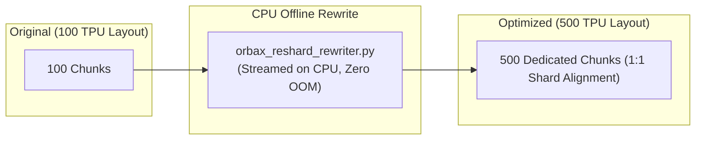

# Benchmark Preparation & Infrastructure Tools (`tools/`)

This directory contains unified preparation tools for infrastructure provisioning, environment diagnostics, and synthetic dataset generation across `gcloud-ml-benchmarks`.

---

## 1. Infrastructure Management (`tools/infrastructure/`)

### `bucket_manager.py`
Deterministic GCS bucket provisioning, discovery, and inspection tool using ADC credentials (`google.cloud.storage`).

```bash
# Ensure a Regional bucket exists
python3 tools/infrastructure/bucket_manager.py \
  --action ensure \
  --project-id "my-project-id" \
  --bucket-type regional \
  --location us-central1 \
  --bucket-name my-regional-bucket

# Ensure a RAPID Zonal bucket exists
python3 tools/infrastructure/bucket_manager.py \
  --action ensure \
  --project-id "my-project-id" \
  --bucket-type zonal \
  --location us-central1 \
  --zone us-central1-b \
  --bucket-name my-rapid-bucket
```

### `env_checker.py`
Environment and dependency pre-flight diagnostic tool checking system CLI tools (`gcloud`, `kubectl`, `helm`, `python3`, `git`), Python packages (`google-cloud-storage`, `pyyaml`, `pyarrow`, etc.), and active GCP/Kubernetes authentication contexts.

```bash
# Run environment pre-flight diagnostic check
python3 tools/infrastructure/env_checker.py --format=table

# Output JSON summary for automated verification
python3 tools/infrastructure/env_checker.py --format=json
```

### `cluster_manager.py`
GKE cluster diagnostics, GCSFuse CSI Driver addon status check, VPC MTU check, and JobSet CRD verification.

```bash
python3 tools/infrastructure/cluster_manager.py \
  --cluster-name my-gke-cluster \
  --zone us-central1-b \
  --project-id my-project-id
```

---

## 2. Dataset Tools (`tools/datasets/`)

### `generator.py`
Unified synthetic multi-column dataset generator supporting local POSIX paths, GCSFuse mounts (`/gcs/...`), and direct GCS (`gs://...`).

```bash
python3 tools/datasets/generator.py \
  --output-path "gs://my-bucket/parquet_dataset" \
  --total-size-mb 2048 \
  --num-files 10 \
  --sequence-length 2048 \
  --metadata-bytes-per-row 4096
```

### `converters/parquet_to_arrayrecord.py`
Converts raw Parquet text shards into pre-tokenized `ArrayRecord` binary shards (`.array_record`).

```bash
python3 tools/datasets/converters/parquet_to_arrayrecord.py \
  --input-path "gs://my-bucket/parquet_dataset" \
  --output-path "gs://my-bucket/arrayrecord_dataset" \
  --sequence-length 2048 \
  --max-files 20
```

---

## 3. Checkpoint Tools (`tools/checkpoints/`)

### `orbax_reshard_rewriter.py`
High-performance offline Orbax checkpoint resharding and layout optimization tool. Bounded-memory TensorStore streaming engine that operates entirely on cheap CPU nodes without requiring TPU/GPU accelerators or initializing JAX runtimes.

#### 💡 The Problem: Sharding Topology Mismatch & Range Read Storms
When a checkpoint is saved on topology $A$ (e.g. 100 TPU chips) and restored on topology $B$ (e.g. 500 TPU chips):
- Direct restore forces 500 concurrent worker processes to issue overlapping **HTTP Byte-Range Reads** against the old 100-chip chunk boundaries.
- On GCS / GCSFuse, this creates **Range-Read Storms**, request throttling (HTTP 429), and severe TTFB latency, causing expensive accelerator clusters to stall for 10~30 minutes during startup.
- **Solution**: Pre-reshard the checkpoint on CPU nodes so each target worker reads its dedicated 1:1 chunk via fast sequential I/O, reducing restore times from tens of minutes to seconds.



#### Practical Usage Scenarios & Commands

##### Scenario 1: Cluster Scale-Up (100 TPUs -> 500 TPUs)
Pre-partition weights into 500 dedicated chunks matching the target 500-card cluster:

```bash
# 1D Partitioning (e.g., FSDP / Hidden dimension sliced 500 ways)
python3 tools/checkpoints/orbax_reshard_rewriter.py \
  --src-dir "/gcs/my-bucket/checkpoints_100tpu/0" \
  --dst-dir "/gcs/my-bucket/checkpoints_500tpu/0" \
  --strategy dim_partitions \
  --dim-partitions "0:500" \
  --num-workers 16
```

##### Scenario 2: 2D/3D Mesh Topology Alignment
Align chunking with multi-dimensional device meshes (e.g., Data=250, Tensor=2):

```bash
python3 tools/checkpoints/orbax_reshard_rewriter.py \
  --src-dir "/gcs/my-bucket/checkpoints_100tpu/0" \
  --dst-dir "/gcs/my-bucket/checkpoints_500tpu_mesh/0" \
  --strategy dim_partitions \
  --dim-partitions "0:250,1:2" \
  --num-workers 16
```

##### Scenario 3: General Storage I/O Optimization (Optimal 64MB Sequential Blocks)
Consolidate thousands of fragmented small chunks into 64MB sequential blocks:

```bash
python3 tools/checkpoints/orbax_reshard_rewriter.py \
  --src-dir "/path/to/source/checkpoint/0" \
  --dst-dir "/path/to/target/checkpoint_opt/0" \
  --strategy optimal_size \
  --target-chunk-mb 64.0 \
  --num-workers 8
```

##### Scenario 4: Export for Downstream Evaluation / Batch Inference
Strip Adam optimizer states (saves ~67% disk space) and cast precision to `bfloat16`:

```bash
python3 tools/checkpoints/orbax_reshard_rewriter.py \
  --src-dir "/gcs/my-bucket/checkpoints_100tpu/0" \
  --dst-dir "/gcs/my-bucket/checkpoints_500tpu_eval/0" \
  --strategy dim_partitions \
  --dim-partitions "0:500" \
  --strip-opt-state \
  --cast-dtype bfloat16 \
  --verify \
  --num-workers 16
```

##### Scenario 5: Dry Run Inspection
Scan checkpoint and preview chunk reduction and volume without writing files:

```bash
python3 tools/checkpoints/orbax_reshard_rewriter.py \
  --src-dir "/gcs/my-bucket/checkpoints_100tpu/0" \
  --dst-dir "/gcs/my-bucket/checkpoints_500tpu/0" \
  --dry-run
```

#### CLI Options Reference

| Argument | Type | Default | Description |
| :--- | :--- | :--- | :--- |
| `--src-dir` | string | *Required* | Path to source Orbax checkpoint (e.g. `/gcs/bucket/ckpt/0`) |
| `--dst-dir` | string | *Required* | Path to output destination directory |
| `--strategy` | string | `optimal_size` | Chunking strategy: `optimal_size`, `dim_partitions`, `unsharded` |
| `--target-chunk-mb` | float | `64.0` | Target chunk size in MB for `optimal_size` strategy |
| `--dim-partitions` | string | `None` | Partition mapping for `dim_partitions` (e.g. `0:500` or `0:250,1:2`) |
| `--strip-opt-state` | flag | `False` | Strip `opt_state`/`optimizer` to save ~67% storage |
| `--verify` | flag | `False` | Verify numerical integrity between source and target arrays |
| `--dry-run` | flag | `False` | Preview layout plan without writing files |

---

### `benchmark_checkpoint_restore.py`
FSDP Checkpoint Restore Performance Benchmark Tool. Simulates a multi-layer Transformer FSDP checkpoint (e.g. 5 shards), reshard-rewrites it to target cluster worker layout (e.g. 10 workers), and executes concurrent multi-worker restore benchmarks comparing **Un-rewritten (Range Read overhead)** vs **Rewritten (1:1 Shard Alignment)**.

```bash
# Run 5-shard to 10-worker restore comparison benchmark across 4 layers of 4096-dim Transformer
python3 tools/checkpoints/benchmark_checkpoint_restore.py \
  --src-shards 5 \
  --dst-workers 10 \
  --num-layers 4 \
  --hidden-dim 4096 \
  --num-runs 5
```

#### 📊 100GB Empirical Benchmark Findings (GKE + Zonal RAPID GCS)

| 维度 / 属性 | 重写前 (Source 5-Shard Baseline) | 重写后 (Target 10-Shard Optimized) | 收益与加速比 |
| :--- | :--- | :--- | :--- |
| **112 GB 恢复中位耗时** | **33.35 秒** (33,354.5 ms) | **24.74 秒** (24,739.5 ms) | **1.35x 提速 (耗时降低 25.8%)** |
| **GCS 有效恢复吞吐** | **3,438.46 MB/s** (3.44 GB/s) | **4,635.83 MB/s** (4.64 GB/s) | **+1,197.37 MB/s (+1.20 GB/s)** |
| **单矩阵分块几何 (Chunks)** | $[3277, 16384]$ (5 个 214.7MB 文件/矩阵) | $[1639, 16384]$ (10 个 107.4MB 文件/矩阵) | 1:1 独立分块，消除 Range 读争抢 |
| **全量分块文件总数** | 560 个 Chunk 文件 (共 675 个文件) | 1,120 个 Chunk 文件 (共 1,236 个文件) | 收敛在千级，无海量小文件元数据开销 |
| **112 GB 离线重写开销** | N/A | **仅 63.14 秒** (1.82 GB/s 重写吞吐) | 16 线程并发流水线，内存峰值 < 1.2 GB |


